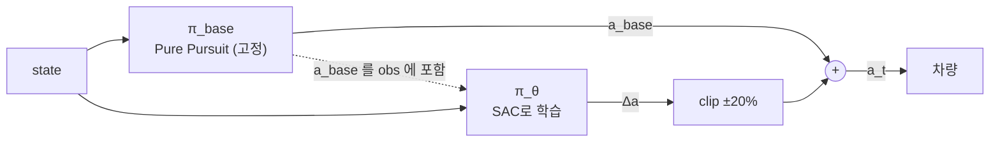

# Residual Policy Learning

> [!abstract] 한 줄
> policy가 action **전체**를 내는 대신, **기존 컨트롤러 출력에 얹을 보정항(residual)만** 학습한다.
> 우리 프로젝트에서는 `controller/controller/combined` 의 **L1/Pure Pursuit을 고정 baseline으로 두고**,
> RL이 *"PP가 틀리는 만큼"* 만 배우는 형태가 된다.

---

## 정의

$$a_t = \underbrace{\pi_{\text{base}}(s_t)}_{\text{고정. 학습하지 않음}} \;+\; \underbrace{\pi_\theta(s_t)}_{\text{학습하는 residual}}$$



> [!important] residual의 가치는 전부 "baseline이 쓰지 않는 관측"에서 나온다
> Pure Pursuit은 **기하만** 본다 (lookahead point, 곡률).
> residual policy는 $v_y$, slip angle $\beta$, yaw rate $\dot\psi$ **이력**을 본다.
> **그 정보 차이가 곧 보정 능력의 상한이다.** → [[POMDP]], [[프로젝트 스택]] §8-3

---

## 왜 이득인가

| # | 이유 | 설명 |
|---|---|---|
| ① | **탐색이 유능한 상태에서 시작** | $\Delta a \approx 0$ 초기화 → **step 0부터 랩 완주.** 맨땅 SAC는 첫 수십만 스텝을 첫 코너에서 박으며 보낸다. *"운전하는 법"* 탐색이 통째로 사라진다 |
| ② | **학습 대상의 크기가 작다** | $\lvert\Delta\delta\rvert \ll \delta_{\max}$. 출력 범위가 좁으면 근사할 함수가 쉽고 policy gradient 분산이 줄어든다 |
| ③ | **안전 하한** | residual을 clip하면 최악이 *"baseline + 유계 섭동"*. **검증 가능한 성질.** 순수 RL엔 이런 하한이 없다 |
| ④ | **sim2real 위험이 residual 크기로 제한** | PP는 기하 법칙이라 sim/real에서 동일하게 동작. 전이 위험을 지는 건 residual뿐 |
| ⑤ | **디버깅 가능** | residual을 로깅하면 *"baseline이 어디서 얼마나 틀리는지"* 가 보인다. E2E에서는 원천적으로 불가능 |
| ⑥ | **★ 학습 대상이 물리적 의미를 갖는다** | 아래 |

### ⑥ 상세 — 우리 논문의 핵심 그림이 된다

Pure Pursuit은 **kinematic(무슬립) 영역에서 정확하고 한계에서 틀린다.** 따라서 residual은 자연히:

- 저속·고그립 → $\Delta \approx 0$
- 고속·저그립 → $\Delta$ 커짐

**즉 residual 그 자체가 "kinematic bicycle 모델이 표현할 수 없는 슬립 보정량"이다.**

> residual 크기를 slip angle / $\mu$ / 속도에 대해 플롯하면,
> policy가 **물리적으로 의미 있는 것을 배웠다**는 직접적 증거가 된다.
> E2E policy로는 이 분해가 불가능하다.

---

## ⚠️ 우리 논문에 생기는 긴장

연구 동기가 *"per-surface manual gain retuning을 없앤다"* 인데,
**residual RL은 PP를 남기므로 PP의 게인이 루프에 그대로 있다.**

| | 방식 | 주장할 수 있는 것 |
|---|---|---|
| **(a)** | PP를 **nominal 조건에서 한 번만** 튜닝, 노면 변화는 residual이 흡수 | *"tune once, adapt automatically"* — **"no tuning"이 아니다** |
| **(b)** | **Attenuated residual**: $a = (1-\beta)a_{\text{base}} + \beta\, a_{\text{RL}}$, 학습 중 $\beta: 0 \to 1$ | 배포 시 baseline이 **사라짐** → *"no tuning"* 유지 |

(b)가 [[α-RPO (2026)]]가 존재하는 이유다 — baseline을 **탐색 보조로만 쓰고 점진적으로 떼어내** 독립 policy를 얻는다.

> [!tip] 권고 순서
> **(a)로 시작 → 되면 (b) 시도.** (a)만으로도 방어 가능한 기여이고, 문구만 정직하게 쓰면 된다.

---

## 구현 디테일 — 여기서 다들 틀린다

### ① 마지막 레이어를 0 근처로 초기화

안 하면 SAC의 초기 entropy가 residual을 크게 만들어 **baseline보다 못한 상태에서 시작**한다.
이득 ①이 통째로 날아간다.

```python
nn.init.uniform_(self.fc_mu.weight, -1e-3, 1e-3)
nn.init.zeros_(self.fc_mu.bias)
```

### ② residual을 반드시 bound

```python
RESIDUAL_SCALE = np.array([0.10, 1.0])   # Δκ [1/m], Δa_x [m/s²]
delta_a = RESIDUAL_SCALE * tanh_output   # tanh 출력이 [-1,1] → 자연히 유계
```

안 하면 policy가 baseline을 상쇄하고 자기 멋대로 한다 → **하이브리드 비용만 내고 순수 RL이 된다.**

### ③ observation에 `a_base` 를 포함

무엇을 보정하는지 모르면 policy가 state에서 역추론해야 한다. 낭비다.

### ④ baseline은 sim과 real에서 **같은 코드**

`common/action_convert.py` 와 같은 원칙. 구현 두 벌은 그 차이가 곧 reality gap이다.

---

## ❌ 실패 모드

| 실패 | 증상 | 원인 · 대응 |
|---|---|---|
| **residual이 주도권을 가져감** | $\lvert\Delta\rvert$ 가 계속 clip 상한에 붙어 있음 | bound가 너무 큼. 좁히고 초과분에 페널티 |
| **baseline이 "부정확"이 아니라 "잘못"** | 진동·발산을 residual이 못 잡음 | residual은 baseline이 **good but imprecise** 일 때 작동. **wrong** 이면 못 고친다 → PP를 먼저 안정화 |
| **평가에서 기여 분리 불가** | *"RL이 한 게 뭐냐"* | baseline 단독 / baseline+residual / **residual 크기**를 함께 보고. 오히려 기여를 정량화하는 기회 |
| **residual이 0으로 수렴** | 학습이 아무것도 안 함 | reward가 baseline 대비 개선을 보상하지 않음. progress 항 강화 또는 $v_{\max}$ 상향으로 **baseline이 실패하는 영역**을 만들어야 한다 |

---

## 우리 코드에 붙이는 형태

```python
# envs/racing_env.py
from controller.combined.src.Controller import Controller   # ← 그대로 재사용

self.pp = Controller(t_clip_min=0.7, t_clip_max=8.0, m_l1=0.47, q_l1=-0.2, ...)
#                    └─ controller.yaml 값. nominal 조건에서 한 번만 튜닝

# --- step ---
delta_base, v_base = self.pp.compute(state, ref_path)    # ⚠️ 실제 시그니처 확인 필요
kappa_base = math.tan(delta_base) / WHEELBASE            # PP 출력을 κ 단위로
ax_base    = (v_base - v_meas) / dt

obs = concat([scan_270_x4, ego_dyn_x16, ref_path_ego, [kappa_base, ax_base]])
#                                                      └─ ③ a_base 포함

d_kappa, d_ax = RESIDUAL_SCALE * policy(obs)             # ② 유계
delta, v = action_to_drive(kappa_base + d_kappa,
                           ax_base + d_ax, v_meas, dt)   # sim/real 공유 함수
```

> [!note] `Controller.py` 는 평범한 python 클래스다
> ROS 노드는 `controller_manager.py` 쪽이다. 학습 루프에서 직접 인스턴스화하면 된다.
> ⚠️ 단 **입출력 시그니처는 아직 확인하지 못했다** — 어댑터가 필요할 수 있다. → [[프로젝트 스택]] §12-2

---

## 변종 3가지

| 형태 | 식 | 용도 |
|---|---|---|
| **Additive** | $a = a_{\text{base}} + \Delta a$ | 기본. 위 설명 전부 |
| **Gain residual** | $a = \pi_{\text{base}}(s;\ g_0(1+\Delta g))$ | PP의 **게인 자체**를 조절. 출력이 아니라 파라미터를 보정 → 더 해석 가능, 표현력은 낮음 |
| **Attenuated** | $a = (1-\beta)a_{\text{base}} + \beta a_{\text{RL}}$, $\beta: 0 \to 1$ | 최종적으로 baseline을 떼어냄 |

**Gain residual**은 "동적 lookahead 조절"로 이미 연구되어 있다 —
[Learning to Tune Pure Pursuit with PPO](https://arxiv.org/html/2602.18386v1),
[Dynamic Lookahead via RL-based Pure Pursuit](https://arxiv.org/html/2603.28625).
우리 논문의 **중간 baseline** 후보로도 좋다.

---

## 📚 참고문헌

| 논문 | 내용 |
|---|---|
| **Silver et al. (2018)** — *Residual Policy Learning* (arXiv:1812.06298) | 개념 원전 |
| **Johannink et al. (ICRA 2019)** — *Residual RL for Robot Control* (arXiv:1812.03201) | 로봇 제어 적용. 읽기 쉬움 |
| **Trumpp et al. (RLJ 2025)** — [*On-Board RL for High Performance Autonomous Racing*](https://rlj.cs.umass.edu/2025/papers/RLJ_RLC_2025_90.pdf) | **Pure Pursuit 위의 residual.** 우리와 가장 가까움 |
| [α-RPO](https://arxiv.org/html/2603.12960) | attenuated 변종 |
| [*A Residual Method for Zero-Shot Real-World Racing on Scaled Platforms*](https://arxiv.org/html/2501.17311) | 스케일 차량 실차 |

> [!warning] arXiv 번호 미검증
> 조사 세션에서 arxiv.org가 차단되어 있어 일부 번호를 확인하지 못했다. **제목으로 검색할 것.**

---

## 🔗 연결

- [[프로젝트 스택]] — §9-3 `controller/combined` 판정, §13 결정 로그
- [[SAC (Haarnoja 2018)]] · [[SAC v2 (Haarnoja 2018)]] — residual head도 squashed Gaussian
- [[TC-Driver (ETH 2022)]] — trajectory-conditioned. residual과 **직교하는** 아이디어 (둘을 합칠 수 있다)
- [[Asymmetric Actor-Critic (Pinto 2017)]] — critic만 privileged. residual과 병행 가능
- [[Options framework (Sutton 1999)]] — 대조: 계층을 **시간축**으로 나누는 것 vs residual은 **크기축**으로 나누는 것
- 미해결: [[Residual Policy Learning (Silver 2018)]] · [[α-RPO (2026)]] · [[MPCC (Liniger 2015)]]
