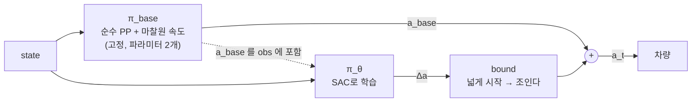

# Residual Policy Learning

> [!abstract] 한 줄
> policy가 action **전체**를 내는 대신, **기존 컨트롤러 출력에 얹을 보정항(residual)만** 학습한다.
> 우리 프로젝트의 $\pi_{\text{base}}$ 는 **순수 Pure Pursuit**(파라미터 1개)이고,
> RL이 *"PP가 틀리는 만큼"* 만 배운다.

> [!warning] 2026-09-23 정정 — base 는 스택의 `Controller.py` 가 **아니다**
> 이전 판에서는 `controller/controller/combined` 의 L1 컨트롤러를 base 로 잡았다. 취소한다.
> 그 파일은 **내부 상태 4개**(EMA 필터, PID 적분기, prev error, slew 기억)와
> 상태머신 기반 게인 점프를 갖고 있어 **관측에 없는 상태가 base 출력을 바꾼다**
> → residual 입장에서 환경이 non-Markovian 이 된다. 아래 §base 선정 참조.
> `Controller.py` 는 버리지 않는다 — **비교군(실전 기준선)** 으로 쓴다.

---

## 정의

$$a_t = \underbrace{\pi_{\text{base}}(s_t)}_{\text{고정. 학습하지 않음}} \;+\; \underbrace{\pi_\theta(s_t)}_{\text{학습하는 residual}}$$



> [!important] residual의 가치는 전부 "baseline이 쓰지 않는 관측"에서 나온다
> Pure Pursuit은 **기하만** 본다 (lookahead point, 곡률).
> residual policy는 $v_y$, slip angle $\beta$, yaw rate $\dot\psi$ **이력**을 본다.
> **그 정보 차이가 곧 보정 능력의 상한이다.** → [[POMDP]], [[프로젝트 스택]] §8-3

---

## ★ base 선정 — 왜 순수 PP 인가 (2026-09-23 확정)

### 기각: 스택의 `Controller.py`

`controller/controller/combined/src/Controller.py` 는 호출 간에 상태를 들고 있다.

```python
self.filtered_heading_error    # EMA 필터 (alpha=0.1) — 1차 지연
self.heading_error_integral    # PID 적분기 — 누적, 상한 없음
self.prev_heading_error        # D 항
self._speed_cmd_prev           # slew limiter 기억
```

여기에 `self.state`(START/TRAILING/OVERTAKE)가 게인을 이산적으로 바꾼다
(`dynamic_gain *= 0.65`). 생성자 인자는 **40개**다.

> [!danger] 숨은 상태는 imprecise 가 아니라 **unobservable** 이다
> 같은 관측에서 base 출력이 달라지면 residual 입장에서 환경이 non-Markovian 이 된다.
> SAC 가 배울 대상이 차량 동역학이 아니라 **적분기의 궤적**이 된다.
> 아래 실패 모드 표의 *"baseline 이 wrong 이면 못 고친다"* 보다 나쁜 경우다.

부수적으로 **배치가 안 된다** (numpy 단일 차량 + 분기 다수) → 256 env × 50 Hz 불가.
순수 PP 는 torch 10줄이면 배치된다. 이것만으로도 결정이 강제된다.

### 채택: 순수 PP + 마찰원 속도 규칙

| 축 | 식 | 파라미터 |
|---|---|---|
| 횡 | $\delta = \arctan\!\big(2L\sin\eta / L_d\big)$, $\;L_d = \mathrm{clip}(m_{l1}v + q_{l1},\,t_{\min},\,t_{\max})$ | lookahead 규칙 (스택 값 재사용) |
| 종 | $v_{\text{ref}} = \sqrt{a_{\text{lat,max}} / \lvert\kappa\rvert}$ | $a_{\text{lat,max}}$ 하나 |

**Pure Pursuit 은 횡방향 전용**이라 $a_x$ base 가 비어 있다. 스택은 그 자리를
`vx_planner` + 보정 6겹으로 채우지만 **ggv 가 자리표시자**(19행 전부 5.0/4.5)라 쓸 수 없다.
그래서 곡률만 보는 기하 규칙으로 채운다 — 교과서 마찰원, 파라미터 1개.

> [!important] 이것은 "속도 상한"이 아니다
> $a_x = a_{x,\text{base}} + \Delta a_\theta$ 이므로 $\Delta a_\theta > 0$ 이면 policy 가 얼마든지 넘어선다.
> 거부했던 것은 **vx 를 상한으로 쓰는 것**이었고, base 는 천장이 아니라 **출발점**이다.

$a_{\text{lat,max}} = 3.5$ m/s² 를 고정값으로 쓴다 ($\mu = 3.5/9.81 = 0.357$ 에 해당).

```
|kappa|   R [m]    v_ref [m/s]     비고
 0.05     20.0       8.37
 0.20      5.0       4.18
 0.50      2.0       2.65
 0.761     1.31      2.14         이 트랙의 최소 곡률반경
 → 0        ∞       clip 10.08    VESC 상한 (46500 ERPM / 4614)
```

- 커리큘럼 주 구간($\mu \ge 0.42$)에서 **base 가 항상 실현 가능**하다
  → residual 은 대부분 *"더 갈 수 있는가"* 만 배운다
- 꼬리 구간($\mu < 0.357$)에서는 base 가 **실현 불가능**해진다
  → residual 이 **감속**을 배워야 한다. 이게 우리가 보고 싶은 능력이므로 의도된 설계다

### 이 분리가 strawman 문제를 없앤다

순수 PP 는 이제 **베이스라인이 아니라 우리 방법의 부품**이다. 비교 대상은 실전 컨트롤러가 그대로 남는다.

```
① Controller.py 단독        실전 기준선 (40 파라미터, 보정 8겹)
② 순수 PP 단독              base 가 어디서 무너지는가
③ 순수 PP + residual        우리 방법
```

②가 있어야 ③의 승리가 *residual 덕분*인지 *PP 가 원래 L5 보다 나았던 것*인지 갈린다.

---

## 왜 이득인가

| # | 이유 | 설명 |
|---|---|---|
| ① | **탐색이 유능한 상태에서 시작** | $\Delta a \approx 0$ 초기화 → **step 0부터 랩 완주.** 맨땅 SAC는 첫 수십만 스텝을 첫 코너에서 박으며 보낸다. *"운전하는 법"* 탐색이 통째로 사라진다 |
| ② | **학습 대상의 크기가 작다** | $\lvert\Delta\delta\rvert \ll \delta_{\max}$. 출력 범위가 좁으면 근사할 함수가 쉽고 policy gradient 분산이 줄어든다 |
| ③ | **안전 하한** | residual을 clip하면 최악이 *"baseline + 유계 섭동"*. **검증 가능한 성질.** 순수 RL엔 이런 하한이 없다 |
| ④ | **sim2real 위험이 residual 크기로 제한** | PP는 기하 법칙이라 sim/real에서 동일하게 동작. 전이 위험을 지는 건 residual뿐 |
| ⑤ | **디버깅 가능** | residual을 로깅하면 *"baseline이 어디서 얼마나 틀리는지"* 가 보인다. E2E에서는 원천적으로 불가능 |
| ⑥ | **★ 학습 대상이 물리적 의미를 갖는다** | 아래 |

### ⑥ 상세 — 우리 논문의 핵심 그림이 된다

Pure Pursuit은 **kinematic(무슬립) 영역에서 정확하고 한계에서 틀린다.** 따라서 residual은 자연히:

- 저속·고그립 → $\Delta \approx 0$
- 고속·저그립 → $\Delta$ 커짐

**즉 residual 그 자체가 "kinematic bicycle 모델이 표현할 수 없는 슬립 보정량"이다.**

> residual 크기를 slip angle / $\mu$ / 속도에 대해 플롯하면,
> policy가 **물리적으로 의미 있는 것을 배웠다**는 직접적 증거가 된다.
> E2E policy로는 이 분해가 불가능하다.

---

## ⚠️ 우리 논문에 생기는 긴장

연구 동기가 *"per-surface manual gain retuning을 없앤다"* 인데,
**residual RL은 PP를 남기므로 PP의 게인이 루프에 그대로 있다.**

| | 방식 | 주장할 수 있는 것 |
|---|---|---|
| **(a)** | PP를 **nominal 조건에서 한 번만** 튜닝, 노면 변화는 residual이 흡수 | *"tune once, adapt automatically"* — **"no tuning"이 아니다** |
| **(b)** | **Attenuated residual**: $a = (1-\beta)a_{\text{base}} + \beta\, a_{\text{RL}}$, 학습 중 $\beta: 0 \to 1$ | 배포 시 baseline이 **사라짐** → *"no tuning"* 유지 |

(b)가 [[α-RPO (2026)]]가 존재하는 이유다 — baseline을 **탐색 보조로만 쓰고 점진적으로 떼어내** 독립 policy를 얻는다.

> [!tip] 권고 순서
> **(a)로 시작 → 되면 (b) 시도.** (a)만으로도 방어 가능한 기여이고, 문구만 정직하게 쓰면 된다.

---

## 구현 디테일 — 여기서 다들 틀린다

### ① 마지막 레이어를 0 근처로 초기화

안 하면 SAC의 초기 entropy가 residual을 크게 만들어 **baseline보다 못한 상태에서 시작**한다.
이득 ①이 통째로 날아간다.

```python
nn.init.uniform_(self.fc_mu.weight, -1e-3, 1e-3)
nn.init.zeros_(self.fc_mu.bias)
```

### ② residual을 bound 하되 **좁게 잡지 않는다** (2026-09-23 수정)

```python
RESIDUAL_SCALE = np.array([0.40, 3.0])   # Δκ [1/m], Δa_x [m/s²]  ← 넓게 시작
delta_a = RESIDUAL_SCALE * tanh_output   # tanh 출력이 [-1,1] → 자연히 유계
```

이전 판의 `[0.10, 1.0]` 은 너무 좁다. 우리 차 기준:

```
delta_max = 0.4189 rad,  L = 0.33 m
kappa_max = tan(0.4189)/0.33 = 1.349 1/m

Δkappa bound 0.10  →  전체 조향 범위의 7.4%
Δkappa bound 0.40  →  30%
```

> [!warning] 좁은 bound 는 거부했던 문제를 다시 들여온다
> *"policy 가 우리가 추측한 한계를 못 넘는다"* — `vx` 를 상한으로 쓰는 것을 거부한 이유와 **구조가 같다.**
> 저마찰에서 필요한 countersteer 가 7% 를 넘을 가능성이 높다.

**운용 방침**: 넓게 시작 → 데이터로 조인다.

| 로그 | 해석 | 조치 |
|---|---|---|
| $\lvert\Delta\rvert$ 가 계속 bound 에 붙어 있음 | bound 가 부족 | 넓힌다 |
| bound 의 20% 이내만 씀 | 여유 과다 | 조인다 (분산 감소) |

①(마지막 레이어 0 초기화)이 있으면 bound 가 넓어도 **출발점은 여전히 base** 라 위험이 작다.

안 하면 policy가 baseline을 상쇄하고 자기 멋대로 한다 → **하이브리드 비용만 내고 순수 RL이 된다.**

### ③ observation에 `a_base` 를 포함

무엇을 보정하는지 모르면 policy가 state에서 역추론해야 한다. 낭비다.

### ④ baseline은 sim과 real에서 **같은 코드**

`common/action_convert.py` 와 같은 원칙. 구현 두 벌은 그 차이가 곧 reality gap이다.

---

## ❌ 실패 모드

| 실패 | 증상 | 원인 · 대응 |
|---|---|---|
| **residual이 주도권을 가져감** | $\lvert\Delta\rvert$ 가 계속 clip 상한에 붙어 있음 | bound가 너무 큼. 좁히고 초과분에 페널티 |
| **baseline이 "부정확"이 아니라 "잘못"** | 진동·발산을 residual이 못 잡음 | residual은 baseline이 **good but imprecise** 일 때 작동. **wrong** 이면 못 고친다 → PP를 먼저 안정화 |
| **평가에서 기여 분리 불가** | *"RL이 한 게 뭐냐"* | baseline 단독 / baseline+residual / **residual 크기**를 함께 보고. 오히려 기여를 정량화하는 기회 |
| **residual이 0으로 수렴** | 학습이 아무것도 안 함 | reward가 baseline 대비 개선을 보상하지 않음. progress 항 강화 또는 $v_{\max}$ 상향으로 **baseline이 실패하는 영역**을 만들어야 한다 |

---

## 우리 코드에 붙이는 형태

> [!note] 코드 위치 (2026-09-23 확정)
> `nhg0209/rl-racing` (신규 repo). 볼트는 노트만 유지한다.
> $\pi_{\text{base}}$ 와 action/obs 변환은 **sim·real 공유 코드**라 실차에 `pip install` 된다 —
> Obsidian 볼트를 차에 설치할 수는 없다. 상세는 [[공유 인터페이스 (sim ↔ real)]].

```python
# rl_racing/common/base_policy.py  — sim/real 공유. ROS 의존 금지
def pure_pp(frenet, preview, v, cfg):          # 전부 (B,) 배치
    L_d   = clamp(cfg.m_l1*v + cfg.q_l1, cfg.t_clip_min, cfg.t_clip_max)
    eta   = lookahead_angle(frenet, preview, L_d)
    delta = atan(2*cfg.wheelbase*sin(eta) / L_d)
    kappa_base = tan(delta) / cfg.wheelbase

    v_ref = clamp(sqrt(cfg.a_lat_max / abs(kappa_eff)), cfg.v_min, v_cap)
    ax_base = cfg.kp_speed * (v_ref - v)
    return kappa_base, ax_base

# --- env.step ---
o  = tracker.step(xy, yaw)                       # frenet_gpu
pv = trk.preview(o["s"], xy, yaw)
kappa_base, ax_base = pure_pp(o, pv, v, CFG)

obs = concat([ego_dyn_hist, path_feat(o, pv), [kappa_base, ax_base]])
#                                              └─ 구현 ③ a_base 포함
d_kappa, d_ax = RESIDUAL_SCALE * policy(obs)     # 구현 ② 유계
kappa, ax = kappa_base + d_kappa, ax_base + d_ax
delta = atan(cfg.wheelbase * kappa)              # 결정로그 #5
```

### 비교군 `Controller.py` 를 Isaac 에서 돌리는 법

`Controller.py` 의 ROS 의존은 **`visualization_msgs` 단 하나, 1곳**이고
`predict_pub=None` 이면 publish 되지 않는다 (`rclpy` 사용 0회). 그래서 **스택을 고치지 않고** 쓸 수 있다.

```
① import 우회 : sys.modules 에 visualization_msgs.msg 스텁을 심는다
                 Marker / MarkerArray 가 속성만 받아먹는 더미면 충분
② 상태 reset  : filtered_heading_error / heading_error_integral / prev_heading_error
                 → hasattr 지연 초기화라 **del 로 지우면** 다음 호출에 재초기화된다
                 _speed_cmd_prev → None 으로 되돌리면 "first cycle" 경로를 탄다
```

> [!warning] 이 우회는 `Controller.py` 의 `hasattr` 패턴에 의존한다
> 스택이 바뀌면 조용히 깨진다. **회귀 테스트로 막는다** —
> *"리셋 후 같은 입력 → 항상 같은 δ, speed"*.
> 나중에 스택에 정식 `reset()` 을 넣는 편이 낫다 (실차에서도 state 전환 시 적분기가
> 살아남는 건 버그에 가깝다). 그때 GitHub App 설치가 필요하다.

---

## 변종 3가지

| 형태 | 식 | 용도 |
|---|---|---|
| **Additive** | $a = a_{\text{base}} + \Delta a$ | 기본. 위 설명 전부 |
| **Gain residual** | $a = \pi_{\text{base}}(s;\ g_0(1+\Delta g))$ | PP의 **게인 자체**를 조절. 출력이 아니라 파라미터를 보정 → 더 해석 가능, 표현력은 낮음 |
| **Attenuated** | $a = (1-\beta)a_{\text{base}} + \beta a_{\text{RL}}$, $\beta: 0 \to 1$ | 최종적으로 baseline을 떼어냄 |

**Gain residual**은 "동적 lookahead 조절"로 이미 연구되어 있다 —
[Learning to Tune Pure Pursuit with PPO](https://arxiv.org/html/2602.18386v1),
[Dynamic Lookahead via RL-based Pure Pursuit](https://arxiv.org/html/2603.28625).
우리 논문의 **중간 baseline** 후보로도 좋다.

---

## 📚 참고문헌

| 논문 | 내용 |
|---|---|
| **Silver et al. (2018)** — *Residual Policy Learning* (arXiv:1812.06298) | 개념 원전 |
| **Johannink et al. (ICRA 2019)** — *Residual RL for Robot Control* (arXiv:1812.03201) | 로봇 제어 적용. 읽기 쉬움 |
| **Trumpp et al. (RLJ 2025)** — [*On-Board RL for High Performance Autonomous Racing*](https://rlj.cs.umass.edu/2025/papers/RLJ_RLC_2025_90.pdf) | **Pure Pursuit 위의 residual.** 우리와 가장 가까움 |
| [α-RPO](https://arxiv.org/html/2603.12960) | attenuated 변종 |
| [*A Residual Method for Zero-Shot Real-World Racing on Scaled Platforms*](https://arxiv.org/html/2501.17311) | 스케일 차량 실차 |

> [!warning] arXiv 번호 미검증
> 조사 세션에서 arxiv.org가 차단되어 있어 일부 번호를 확인하지 못했다. **제목으로 검색할 것.**

---

## 🔗 연결

- [[공유 인터페이스 (sim ↔ real)]] — π_base·action·obs 규약 (여기서 어긋나면 재학습)
- [[프로젝트 스택]] — §9-3 `controller/combined` 판정, §13 결정 로그 #16~#19
- [[SAC (Haarnoja 2018)]] · [[SAC v2 (Haarnoja 2018)]] — residual head도 squashed Gaussian
- [[TC-Driver (ETH 2022)]] — trajectory-conditioned. residual과 **직교하는** 아이디어 (둘을 합칠 수 있다)
- [[Asymmetric Actor-Critic (Pinto 2017)]] — critic만 privileged. residual과 병행 가능
- [[Options framework (Sutton 1999)]] — 대조: 계층을 **시간축**으로 나누는 것 vs residual은 **크기축**으로 나누는 것
- 미해결: [[Residual Policy Learning (Silver 2018)]] · [[α-RPO (2026)]] · [[MPCC (Liniger 2015)]]
