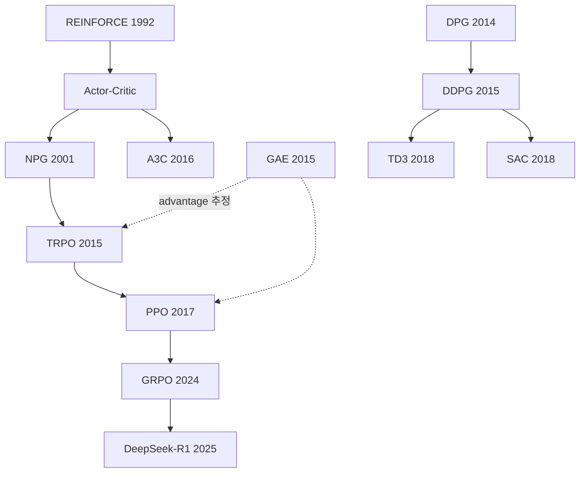
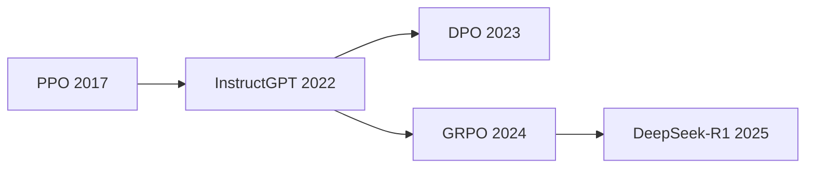

# RL 지도

전체 논문 아카이브의 최상위 지도. 새 논문을 정리하면 해당 계보에 링크를 추가합니다.

> [!tip] 사용법
> 아직 안 읽은 논문은 **미해결 링크**(연한 색)로 남겨둡니다.
> 그래프 뷰에서 속이 빈 노드로 보이므로, **다음에 읽을 것**이 자동으로 보입니다.

---

## 🎯 현재 학습 경로 — E2E 자율주행 레이싱

목표: **[[RL 로드맵|TM07 리포트]]** (Asymmetric SAC + Sim-to-Real) 수준의 스택을 재현·개선.
전체 로드맵은 [`docs/RL_ROADMAP.md`](../docs/RL_ROADMAP.md) 참고.

> [!important] 우선순위 논문 4편
> 아래 순서대로 읽습니다. 위 계보도는 이 4편의 **배경**을 잡기 위한 지도입니다.
>
> 1. [[SAC (Haarnoja 2018)]] — `arXiv:1801.01290` §3.2 → §4 → Appendix C
> 2. [[SAC v2 (Haarnoja 2018)]] — `arXiv:1812.05905`, auto entropy tuning
> 3. [[Asymmetric Actor-Critic (Pinto 2017)]] — `arXiv:1710.06542`, 짧음
> 4. [[TM07 리포트 (2025)]] — Asymmetric SAC 레이싱 아키텍처

### 리포트 구성요소 → 필요한 개념

| TM07의 구성요소 | 읽어야 할 것 |
|---|---|
| Soft Actor-Critic | [[SAC (Haarnoja 2018)]], [[Maximum Entropy RL]] |
| Actor는 LiDAR, Critic은 24-dim privileged obs | [[Asymmetric Actor-Critic (Pinto 2017)]], [[POMDP]] |
| history $N=4$ frame stacking | [[POMDP]] |
| Two-Phase Automatic Curriculum | [[Curriculum Learning]] |
| $R = r_{\text{progress}} + r_{\text{safety}} + r_{\text{TTC}} + r_{\text{overtake}}$ | [[Reward Shaping]], [[Potential-based Shaping]] |
| steering smoothness penalty | [[Action Smoothness]] — sim2real 필수 |
| Opponent lookahead 랜덤화 | [[Domain Randomization]] |

---

## 🔧 Sim-to-Real

- [[Domain Randomization (Tobin 2017)]] — 시뮬레이터 파라미터를 흔들어 실물 격차 흡수
- [[Asymmetric Actor-Critic (Pinto 2017)]] — 학습 때만 특권 정보를 쓰는 구조
- [[Action Smoothness]] — 실물 액추에이터 보호 및 진동 억제

---

## 📐 계보: Policy Gradient 계열

- [[REINFORCE (Williams 1992)]] — policy gradient의 원형, 高분산
- [[GAE (Schulman 2015)]] — bias–variance 트레이드오프를 $\lambda$로 조절
- [[TRPO (Schulman 2015)]] — KL 제약으로 monotonic improvement 보장
- [[PPO (Schulman 2017)]] — TRPO를 clipping으로 단순화, 사실상 표준
- [[DDPG (Lillicrap 2015)]] — 연속 행동공간, off-policy
- [[TD3 (Fujimoto 2018)]] — DDPG의 과대추정 편향 수정
- [[SAC (Haarnoja 2018)]] — 최대 엔트로피 목적함수 ⭐ **현재 목표 논문**
- [[SAC v2 (Haarnoja 2018)]] — 온도 $\alpha$ 자동 조정 ⭐

**관통하는 질문**: 정책을 얼마나 크게 업데이트해도 안전한가?
→ NPG(자연 그래디언트) → TRPO(신뢰 영역) → PPO(클리핑)로 **같은 문제의 답이 점점 싸지는** 흐름.

---

## 📊 계보: Value-based 계열

- [[DQN (Mnih 2015)]] — replay buffer + target network로 딥러닝 안정화
- [[Double DQN (van Hasselt 2015)]] — max 연산의 과대추정 편향
- [[Dueling DQN (Wang 2016)]] — $Q = V + A$ 분해
- [[Prioritized Experience Replay (Schaul 2015)]]
- [[Rainbow (Hessel 2017)]] — 위 개선들의 조합, ablation이 핵심
- [[C51 (Bellemare 2017)]] — 분포적 RL, 기댓값 대신 분포를 학습

**관통하는 질문**: $\max$ 연산자가 만드는 과대추정을 어떻게 막는가?

---

## 🌍 계보: Model-based

- [[World Models (Ha 2018)]]
- [[Dreamer (Hafner 2019)]] → v2 → v3
- [[MuZero (Schrittwieser 2019)]] — 모델을 픽셀이 아니라 **가치 예측에 필요한 것만** 학습

---

## 💾 계보: Offline RL

- [[BCQ (Fujimoto 2019)]] — distribution shift 문제 제기
- [[CQL (Kumar 2020)]] — 보수적 Q 학습
- [[IQL (Kostrikov 2021)]]
- [[Decision Transformer (Chen 2021)]] — RL을 시퀀스 모델링으로 재해석

**관통하는 질문**: 데이터에 없는 행동의 Q값을 왜 믿을 수 없는가?

---

## 🗣️ 계보: RLHF / LLM Post-training

- [[InstructGPT (Ouyang 2022)]] — reward model + PPO
- [[DPO (Rafailov 2023)]] — reward model 없이 선호도에서 직접 최적화
- [[GRPO (Shao 2024)]] — critic 없이 그룹 상대 이점으로 대체
- [[DeepSeek-R1 (2025)]] — 순수 RL로 추론 능력 유도

**관통하는 질문**: 보상이 사람의 선호일 때, 무엇을 최적화 대상으로 삼는가?

---

## 🔍 탐험(Exploration)

- [[ICM (Pathak 2017)]] — 예측 오차를 내재적 보상으로
- [[RND (Burda 2018)]]

---

## 📚 참고

- [`docs/RL_ROADMAP.md`](../docs/RL_ROADMAP.md) — Stage 1~7 학습 로드맵
- [[기호 사전]] — 공통 표기법
- [[질문 로그]] — 지금까지 나온 질문 전체
