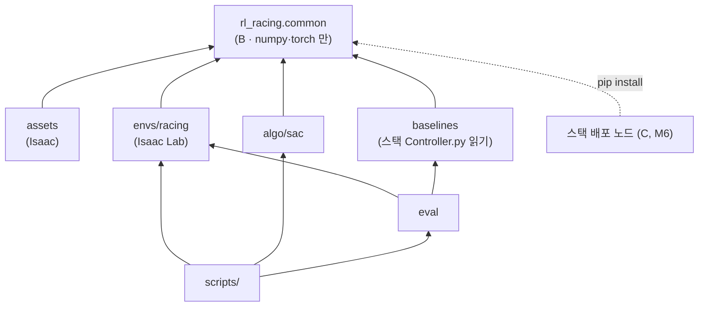

# rl-racing 구조

> [!abstract] 한 줄
> 코드를 **A(학습 전용) · B(sim·실차 공유)** 로 나누고, B 를 `rl_racing/common/` 한 곳에 둔다.
> 의존은 **한 방향** — 모든 것이 `common` 을 import 하고, `common` 은 아무것도 import 하지 않는다.

> [!info] 위치
> [[공유 인터페이스 (sim ↔ real)]] §0 의 A/B/C 분리를 디렉터리로 옮긴 것. 결정 #19(별도 repo) 의 구현.

---

## 0. 원칙 4개

| # | 원칙 | 이유 |
|---|---|---|
| 1 | **의존은 한 방향.** `common` ← `assets`·`envs`·`algo`·`baselines`·`eval`·`scripts` | B 가 학습 코드에 끌려가면 실차에 Isaac 이 따라간다 |
| 2 | **`common` 은 ROS·Isaac import 금지.** numpy·torch 만. Python **3.10 문법까지** | 실차(NUC/Mac)에서 같은 코드가 돈다. NUC 에 Ubuntu 22.04 + ROS 2 Humble 이면 3.10 ⏳ |
| 3 | **스펙은 코드 한 곳.** 차량 상수·obs 순서/정규화·action 규약·npz 스키마 | 두 곳에 있으면 언젠가 어긋나고, 그게 reality gap 이다 |
| 4 | **볼트는 노트만.** 코드는 전부 여기 | 사용자 요청 (#19) |

---

## 1. 디렉터리

```
rl-racing/
├─ pyproject.toml             패키지 rl_racing. 의존 numpy, torch
│                             extras: [dev] pytest·ruff  /  Isaac 은 컨테이너가 제공 (pip 의존에 안 넣음)
├─ README.md
│
├─ rl_racing/
│  ├─ common/                 ★ B — sim·실차 공유.  ROS·Isaac 금지.  py3.10
│  │  ├─ vehicle.py           차량 상수 단일 출처  (L=0.33, δ_max, κ_max, v_max …)
│  │  ├─ track_data.py        reference path 스키마 — 필드·버전·검증, npz 저장/로드
│  │  ├─ frenet.py            FrenetTrack · FrenetTracker        ← tools/frenet_gpu.py
│  │  ├─ base_policy.py       순수 PP (조향만)                    신규
│  │  ├─ action.py            tanh 출력 → (κ, a_x) → δ, governor  신규
│  │  └─ observation.py       actor obs 스펙 + 조립 + spec_hash   신규
│  │
│  ├─ assets/                 A — 차량·트랙 생성 (Isaac 필요)
│  │  ├─ urdf_gen.py                                              ← tools/gen_racecar_urdf.py
│  │  ├─ racecar_cfg.py                                           ← tools/racecar_cfg.py
│  │  └─ track_gen.py                                             ← tools/gen_track.py
│  │
│  ├─ envs/racing/            A — Isaac Lab DirectRLEnv            신규
│  │  ├─ env.py · env_cfg.py
│  │  ├─ reward.py            프로젝트 스택 §10-4
│  │  ├─ critic_obs.py        privileged — μ, v_cap, 실제 벽 거리 …
│  │  ├─ randomization.py     μ, v_cap …
│  │  └─ path_variation.py    d_ref(s) 생성 — 오프셋·경로 교체 (#22)
│  │
│  ├─ algo/                   A — SAC                              신규 (§7 결정 2)
│  │  └─ sac.py               비대칭 critic, head 별 초기화
│  │
│  ├─ baselines/              A — 비교군
│  │  ├─ stack_controller.py  스택 Controller.py 스텁 주입 + 리셋   ← tools/test_controller_adapter.py 의 어댑터 부분
│  │  └─ speed_profile.py     실험 ② 전용 forward/backward pass    인터페이스 §7
│  │
│  └─ eval/                   A — μ 스윕 실행, 지표(랩타임·RMS e_d), 그림
│
├─ scripts/                   진입점만. 로직은 rl_racing/ 안에
│  ├─ train.py · eval_sweep.py · gen_track.py · build_racecar_usd.sh
│  ├─ export_policy.py        M6
│  └─ tools/                  inspect_usd · usd_to_glb · export_usd_portable
│                             measure_gpu_budget · validate_drive (← test_racecar_drive)
│
├─ tests/
│  ├─ test_frenet.py                                              ← tools/test_frenet_gpu.py
│  ├─ test_stack_controller.py   회귀: reset 후 결정성              ← test_controller_adapter.py 의 검사 부분
│  ├─ test_base_policy.py · test_action.py · test_observation.py
│  └─ isaac/                  @pytest.mark.isaac — 컨테이너에서만
│
├─ docker/                    Dockerfile (← ML 서버 노트 §4 본문을 파일로), run.sh,
│                             setup_isaaclab.sh · fix_isaaclab_deps.sh · check_isaac_env.sh · verify_isaaclab.py
├─ maps/<name>/global_waypoints.json      입력만 복사, 출처 스택 커밋 기록 (§7 결정 4)
└─ build/                     .gitignore — *.usd, *.npz, 체크포인트, 로그
```

---

## 2. 의존 그래프



`common` 에서 나가는 화살표는 **없다.** 테스트로 강제한다 (`common` 안에서 `isaaclab`·`pxr`·`rclpy` import 시 실패).

---

## 3. B(`common`) 공개 API — 시그니처 수준

> 코드가 아니라 **약속**이다. 구현 전에 이 표가 합의돼야 한다.

| 모듈 | 공개 이름 | 비고 |
|---|---|---|
| `vehicle` | `VEHICLE` (frozen dataclass) | `wheelbase=0.33` 단일값. URDF 생성기도 여기서 읽는다 → 0.33 vs 0.3302 이중값 해소 |
| `track_data` | `RefPath` (배열 묶음) · `load_npz` · `save_npz` · `validate` | **스키마 버전 필드**. 균일 격자 검사가 여기로 이동 |
| `frenet` | `FrenetTrack.from_npz(path)` · **`FrenetTrack.from_arrays(...)`** · `FrenetTracker` | ★ 실차에는 npz 가 없다 — 스택이 발행하는 global raceline 배열로 만든다. 그래서 `from_arrays` 가 1급이다 |
| `base_policy` | `pure_pp(frenet_out, preview, v, cfg) -> kappa_pp` | (B,) 배치. 조향만 |
| `action` | `compose(tanh_out, kappa_pp) -> (delta, a_x)` · `governor(a_x, v, v_lim, k_g)` | residual 합성은 **여기**에서 한다 → 알고리즘은 residual 을 모른다 |
| `observation` | `ACTOR_OBS_SPEC` · `build_actor_obs(...) -> (B, D)` · `spec_hash()` | 이름·순서·차원·스케일을 **선언**으로. critic obs 는 A 쪽(`envs/critic_obs.py`) |

`d_ref(s)` 는 `common` 이 **만들지 않는다.** sim 에서는 `envs/path_variation.py` 가, 실차에서는 스택 local waypoint 의 `d_m` 이 준다.
`common` 은 s 격자 위의 배열로 받기만 한다.

---

## 4. sim2real 가드 — `spec_hash`

export 할 때 policy 파일 메타데이터에 **`spec_hash`**(obs 스펙 + action 규약 + 차량 상수의 해시)를 넣는다.
실차 노드는 기동 시 자기 쪽 `rl_racing.common.spec_hash()` 와 비교하고 **다르면 실행을 거부**한다.

> "B 가 두 벌이 되는" 사고를 **주행 전에** 잡는다. 순서 하나, 스케일 하나 어긋나도 policy 는
> 조용히 다른 함수를 계산한다 — 로그로는 거의 못 찾는다.

---

## 5. 실차 컴퓨터 — NUC 또는 Mac (2026-09-29 정정)

이전 노트의 **Jetson Orin Nano / TensorRT 는 틀렸다.** 정정 결과:

- **TensorRT 불필요.** policy(2×256 MLP)는 CPU 추론으로 충분하다
- **B 는 torch 로 쓰고 실차도 torch CPU 로 같은 코드를 돈다** — 구현이 물리적으로 한 벌
- 배포 형태(torch 직접 vs ONNX Runtime)는 **M6 에 결정.** 지금은 B 를 순수 함수로, 가능한 한 ONNX export 가 되는 형태로 써 두면 둘 다 열려 있다
- ⏳ 확인 필요: 차량 컴퓨터의 **OS · ROS 2 배포판 · Python 버전**. NUC + Ubuntu 22.04 + Humble 이면 3.10.
  **Mac 이면 ROS 2 를 어떻게 돌리는지**(네이티브 / Docker·VM)가 배포 형태를 바꾼다

---

## 6. 이전 계획

| 단계 | 대상 | 검증 위치 |
|---|---|---|
| **1차** | 골격(pyproject·README·.gitignore) · `common/{vehicle, track_data, frenet}` · `tests/test_frenet` · `baselines/stack_controller` + 회귀 테스트 · `docker/` · `maps/` | **Isaac 없이** — 이 세션에서 pytest 로 |
| **2차** | `assets/*` · `scripts/gen_track.py` · `scripts/build_racecar_usd.sh` · `scripts/tools/*` | Isaac 컨테이너 (사용자 실행) |
| **3차** | `common/{base_policy, action, observation}` · `envs/racing` · `algo/sac` · `eval` | 신규 작성 — 각각 구조 합의 후 |

이전이 끝나면 볼트의 `tools/`, `run.sh`, `urdf/`, `f1tenth_URDF/` 를 지우고 노트의 `tools/…` 경로(17곳)를 `rl-racing/…` 로 바꾼다.

> [!warning] 이전은 "복사 + 이름 변경"만 한다
> 1·2차에서 로직을 고치지 않는다. 고칠 것이 보이면 **따로 적고** 이전을 끝낸 뒤 별도 커밋으로.
> 그래야 "옮기다 깨졌나, 고치다 깨졌나"가 갈린다. 1차의 frenet 테스트 수치가 이전 전과 **똑같아야** 한다.

---

## 7. 결정 — ✅ 전부 권고대로 확정 (2026-09-29)

| # | 질문 | 권고 | 근거 |
|---|---|---|---|
| 1 | **Tier 1(f1tenth_gym)을 구조에 넣을까** | ✅ **넣지 않는다** | 아래 |
| 2 | SAC 를 직접 쓸까, skrl 을 쓸까 | ✅ **직접** (CleanRL 계열 단일 파일) | 아래 |
| 3 | 볼트의 코드 삭제 + 노트 경로 갱신 | ✅ 예 (전체 이전 완료 후) | 원칙 4 |
| 4 | 맵은 `global_waypoints.json` 만 복사 | ✅ 예 | `gen_track` 이 쓰는 입력은 이것뿐. pgm/png 는 불필요 |

### 결정 1 — Tier 1 을 빼자는 근거 (이전 권고를 뒤집는다)

[[ML 서버 · Isaac Sim 환경]] §9 에서 나는 **"Tier 1 을 버리지 말 것"** 을 권했다. 근거는 *"Isaac Lab 환경을 만드는
수 주 동안 아무 학습도 못 한다"* 였다. 지금은 사정이 다르다:

- 수 주의 대부분이던 **자산 작업이 끝났다** — URDF→USD 검증, 트랙 USD, 주행·마찰 포화 실측, Frenet projector, 비교군 어댑터. 남은 건 DirectRLEnv 포장
- **연구 질문(μ 스윕)은 Isaac 에서만 의미가 있다** — f1tenth_gym 은 선형 타이어라 포화가 없고(§8-5-1), 포화는 PhysX 에서 실측했다(§8-5-2)
- f1tenth_gym 의 action 은 **(조향, 속도)** 라 우리 **(κ, a_x)** 와 의미가 다르다 → 어댑터 + 두 벌의 동역학 → 그 차이가 또 하나의 gap

필요해지면 `envs/` 아래에 추가할 수 있게 `common` 은 시뮬레이터를 모른다 — 그걸로 충분하다.

### 결정 2 — SAC 를 직접 쓰자는 근거

알고리즘 쪽 요구는 두 개다: **비대칭 critic**(critic 만 privileged obs), **head 별 초기화**(조향 0 / 가속 bias 양수, #21).
residual 합성은 `common/action.py` 에서 하므로 알고리즘은 residual 을 모른다.

- 직접: 두 요구를 **확실히** 넣을 수 있고, 로드맵의 CleanRL `sac_continuous_action.py` 읽기 계획과 맞물린다 — 읽은 코드를 고쳐 쓰게 된다
- skrl: 설치·검증은 끝났고 시간을 아낀다. 단 **SAC 에서 비대칭 critic 입력을 지원하는지 확인하지 못했다** ⏳

학습 목적(내부를 이해)과 디버깅 가시성 때문에 직접을 권하지만, **skrl 이 둘을 지원한다면 합리적인 대안**이다.

---

## 8. 진행 방식 (2026-09-29 확정)

- **브랜치**: `main` 은 빈 init 커밋만 두고, 작업은 **`dev`** 에서 한다. 단계가 검증되고 **사용자가 확인한 뒤** `main` 으로 합친다
- **1차 이전은 Claude Code CLI 로 수행**한다 (이 원격 세션이 아니라). 커밋 C1 골격 → C2 복사 → C3 구조 변경 → C4 비교군
- **이전 중 발견한 흠은 고치지 않고 보고만** 한다. 이전 완료 후 사용자에게 다시 묻는다. 현재 알려진 것:

| # | 흠 | 출처 |
|---|---|---|
| 1 | frenet docstring 의 *"전역 argmin 은 쓸 수 없다"* — 실측으로는 통과했다 (낡은 문장) | frenet 코드 설명 ① |
| 2 | `preview_horizon` 이 0.5 m 과장 (20.0 표시, 마지막 점 19.49 m) | ② |
| 3 | 외적이 정확히 0 이면 `d = 0` | ③ |
| 4 | preview 설정이 트랙 데이터(npz)에 들어 있다 — 관측 설계 소관 (3차 `observation.py`) | 1차 설명 |
| 5 | wheelbase 0.33 (스택) vs 0.3302 (`lf+lr`, dynamics.yaml) — 2차 URDF 이전 때 결정 | 인터페이스 §1 |

---

## 🔗 연결

- [[공유 인터페이스 (sim ↔ real)]] — B 의 규약 (이 구조가 담는 내용)
- [[프로젝트 스택]] §13 #19 (별도 repo), #21~#24
- [[트랙 생성 · Frenet 변환]] · [[ML 서버 · Isaac Sim 환경]] — 옮겨 올 코드의 기록
