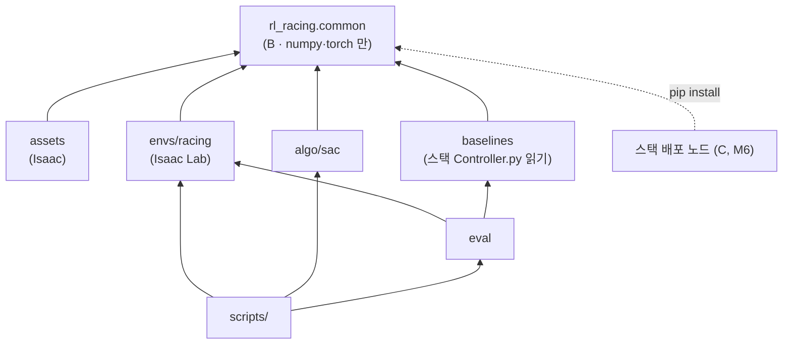

# rl-racing 구조

> [!abstract] 한 줄
> 코드를 **A(학습 전용) · B(sim·실차 공유)** 로 나누고, B 를 `rl_racing/common/` 한 곳에 둔다.
> 의존은 **한 방향** — 모든 것이 `common` 을 import 하고, `common` 은 아무것도 import 하지 않는다.

> [!info] 위치
> [[공유 인터페이스 (sim ↔ real)]] §0 의 A/B/C 분리를 디렉터리로 옮긴 것. 결정 #19(별도 repo) 의 구현.

---

## 0. 원칙 4개

| # | 원칙 | 이유 |
|---|---|---|
| 1 | **의존은 한 방향.** `common` ← `assets`·`envs`·`algo`·`baselines`·`eval`·`scripts` | B 가 학습 코드에 끌려가면 실차에 Isaac 이 따라간다 |
| 2 | **`common` 은 ROS·Isaac import 금지.** numpy·torch 만. Python **3.10 문법까지** | 실차(NUC/Mac)에서 같은 코드가 돈다. 차량 컴퓨터의 Python 버전은 **모른다** — 3.10 은 "어느 쪽이든 돌게" 잡은 안전한 하한 |
| 3 | **스펙은 코드 한 곳.** 차량 상수·obs 순서/정규화·action 규약·npz 스키마 | 두 곳에 있으면 언젠가 어긋나고, 그게 reality gap 이다 |
| 4 | **볼트는 노트만.** 코드는 전부 여기 | 사용자 요청 (#19) |

---

## 1. 디렉터리

```
rl-racing/
├─ pyproject.toml             패키지 rl_racing. 의존 numpy, torch
│                             extras: [dev] pytest·ruff  /  Isaac 은 컨테이너가 제공 (pip 의존에 안 넣음)
├─ README.md
│
├─ rl_racing/
│  ├─ common/                 ★ B — sim·실차 공유.  ROS·Isaac 금지.  py3.10
│  │  ├─ vehicle.py           차량 상수 단일 출처  (L=0.33, δ_max, κ_max, v_max …)
│  │  ├─ track_data.py        reference path 스키마 — 필드·버전·검증, npz 저장/로드
│  │  ├─ frenet.py            FrenetTrack · FrenetTracker        ← tools/frenet_gpu.py
│  │  ├─ base_policy.py       순수 PP (조향만)                    신규
│  │  ├─ action.py            tanh 출력 → (κ, a_x) → δ, governor  신규
│  │  └─ observation.py       actor obs 스펙 + 조립 + spec_hash   신규
│  │
│  ├─ assets/                 A — 차량·트랙 생성 (Isaac 필요)
│  │  ├─ urdf_gen.py                                              ← tools/gen_racecar_urdf.py
│  │  ├─ racecar_cfg.py                                           ← tools/racecar_cfg.py
│  │  └─ track_gen.py                                             ← tools/gen_track.py
│  │
│  ├─ envs/racing/            A — Isaac Lab DirectRLEnv            신규
│  │  ├─ env.py · env_cfg.py
│  │  ├─ reward.py            프로젝트 스택 §10-4
│  │  ├─ critic_obs.py        privileged — μ, v_cap, 실제 벽 거리 …
│  │  ├─ randomization.py     μ, v_cap …
│  │  └─ path_variation.py    d_ref(s) 생성 — 오프셋·경로 교체 (#22)
│  │
│  ├─ algo/                   A — SAC                              신규 (§7 결정 2)
│  │  └─ sac.py               비대칭 critic, head 별 초기화
│  │
│  ├─ baselines/              A — 비교군
│  │  ├─ stack_controller.py  스택 Controller.py 스텁 주입 + 리셋   ← tools/test_controller_adapter.py 의 어댑터 부분
│  │  └─ speed_profile.py     실험 ② 전용 forward/backward pass    인터페이스 §7
│  │
│  └─ eval/                   A — μ 스윕 실행, 지표(랩타임·RMS e_d), 그림
│
├─ scripts/                   진입점만. 로직은 rl_racing/ 안에
│  ├─ train.py · eval_sweep.py · gen_track.py · build_racecar_usd.sh
│  ├─ export_policy.py        M6
│  └─ tools/                  inspect_usd · usd_to_glb · export_usd_portable
│                             measure_gpu_budget · validate_drive (← test_racecar_drive)
│
├─ tests/
│  ├─ test_frenet.py                                              ← tools/test_frenet_gpu.py
│  ├─ test_stack_controller.py   회귀: reset 후 결정성              ← test_controller_adapter.py 의 검사 부분
│  ├─ test_base_policy.py · test_action.py · test_observation.py
│  └─ isaac/                  @pytest.mark.isaac — 컨테이너에서만
│
├─ docker/                    Dockerfile (← ML 서버 노트 §4 본문을 파일로), run.sh,
│                             setup_isaaclab.sh · fix_isaaclab_deps.sh · check_isaac_env.sh · verify_isaaclab.py
├─ maps/<name>/global_waypoints.json      입력만 복사, 출처 스택 커밋 기록 (§7 결정 4)
└─ build/                     .gitignore — *.usd, *.npz, 체크포인트, 로그
```

---

## 2. 의존 그래프



`common` 에서 나가는 화살표는 **없다.** 테스트로 강제한다 (`common` 안에서 `isaaclab`·`pxr`·`rclpy` import 시 실패).

---

## 3. B(`common`) 공개 API — 시그니처 수준

> 코드가 아니라 **약속**이다. 구현 전에 이 표가 합의돼야 한다.

| 모듈 | 공개 이름 | 비고 |
|---|---|---|
| `vehicle` | `VEHICLE` (frozen dataclass) | `wheelbase=0.33` 단일값. URDF 생성기도 여기서 읽는다 → 0.33 vs 0.3302 이중값 해소 |
| `track_data` | `RefPath` (배열 묶음) · `load_npz` · `save_npz` · `validate` | **스키마 버전 필드**. 균일 격자 검사가 여기로 이동 |
| `frenet` | `FrenetTrack.from_npz(path)` · **`FrenetTrack.from_arrays(...)`** · `FrenetTracker` | ★ 실차에는 npz 가 없다 — 스택이 발행하는 global raceline 배열로 만든다. 그래서 `from_arrays` 가 1급이다 |
| `base_policy` | `pure_pp(frenet_out, preview, v, cfg) -> kappa_pp` | (B,) 배치. 조향만 |
| `action` | `compose(tanh_out, kappa_pp) -> (delta, a_x)` · `governor(a_x, v, v_lim, k_g)` | residual 합성은 **여기**에서 한다 → 알고리즘은 residual 을 모른다 |
| `observation` | `ACTOR_OBS_SPEC` · `build_actor_obs(...) -> (B, D)` · `spec_hash()` | 이름·순서·차원·스케일을 **선언**으로. critic obs 는 A 쪽(`envs/critic_obs.py`) |

`d_ref(s)` 는 `common` 이 **만들지 않는다.** sim 에서는 `envs/path_variation.py` 가, 실차에서는 스택 local waypoint 의 `d_m` 이 준다.
`common` 은 s 격자 위의 배열로 받기만 한다.

---

## 4. sim2real 가드 — `spec_hash`

export 할 때 policy 파일 메타데이터에 **`spec_hash`**(obs 스펙 + action 규약 + 차량 상수의 해시)를 넣는다.
실차 노드는 기동 시 자기 쪽 `rl_racing.common.spec_hash()` 와 비교하고 **다르면 실행을 거부**한다.

> "B 가 두 벌이 되는" 사고를 **주행 전에** 잡는다. 순서 하나, 스케일 하나 어긋나도 policy 는
> 조용히 다른 함수를 계산한다 — 로그로는 거의 못 찾는다.

---

## 5. 실차 컴퓨터 — NUC 또는 Mac (2026-09-29 정정)

이전 노트의 **Jetson Orin Nano / TensorRT 는 틀렸다.** 정정 결과:

- **TensorRT 불필요.** policy(2×256 MLP)는 CPU 추론으로 충분하다
- **B 는 torch 로 쓰고 실차도 torch CPU 로 같은 코드를 돈다** — 구현이 물리적으로 한 벌
- 배포 형태(torch 직접 vs ONNX Runtime)는 **M6 에 결정.** 지금은 B 를 순수 함수로, 가능한 한 ONNX export 가 되는 형태로 써 두면 둘 다 열려 있다
- ⏳ 확인 필요: 차량 컴퓨터의 **OS · ROS 2 배포판 · Python 버전** — **현재 모른다** (2026-10-06 사용자 확인).
  작업 PC(CLI 를 돌린 기계, ROS 2 Jazzy · Ubuntu 24.04 · Python 3.12)와는 **다른 구성**이다. 작업 PC 기준으로 추정하지 않는다.
  **Mac 이면 ROS 2 를 어떻게 돌리는지**(네이티브 / Docker·VM)가 배포 형태를 바꾼다

---

## 6. 이전 계획

| 단계 | 대상 | 검증 위치 |
|---|---|---|
| **1차** | 골격(pyproject·README·.gitignore) · `common/{vehicle, track_data, frenet}` · `tests/test_frenet` · `baselines/stack_controller` + 회귀 테스트 · `docker/` · `maps/` | **Isaac 없이** — 이 세션에서 pytest 로 |
| **2차** | `assets/*` · `scripts/gen_track.py` · `scripts/build_racecar_usd.sh` · `scripts/tools/*` | Isaac 컨테이너 (사용자 실행) |
| **3차** | `common/{base_policy, action, observation}` · `envs/racing` · `algo/sac` · `eval` | 신규 작성 — 각각 구조 합의 후 |

이전이 끝나면 볼트의 `tools/`, `run.sh`, `urdf/`, `f1tenth_URDF/` 를 지우고 노트의 `tools/…` 경로(17곳)를 `rl-racing/…` 로 바꾼다.

> [!warning] 이전은 "복사 + 이름 변경"만 한다
> 1·2차에서 로직을 고치지 않는다. 고칠 것이 보이면 **따로 적고** 이전을 끝낸 뒤 별도 커밋으로.
> 그래야 "옮기다 깨졌나, 고치다 깨졌나"가 갈린다. 1차의 frenet 테스트 수치가 이전 전과 **똑같아야** 한다.

---

## 7. 결정 — ✅ 전부 권고대로 확정 (2026-09-29)

| # | 질문 | 권고 | 근거 |
|---|---|---|---|
| 1 | **Tier 1(f1tenth_gym)을 구조에 넣을까** | ✅ **넣지 않는다** | 아래 |
| 2 | SAC 를 직접 쓸까, skrl 을 쓸까 | ✅ **직접** (CleanRL 계열 단일 파일) | 아래 |
| 3 | 볼트의 코드 삭제 + 노트 경로 갱신 | ✅ 예 (전체 이전 완료 후) | 원칙 4 |
| 4 | 맵은 `global_waypoints.json` 만 복사 | ✅ 예 | `gen_track` 이 쓰는 입력은 이것뿐. pgm/png 는 불필요 |

### 결정 1 — Tier 1 을 빼자는 근거 (이전 권고를 뒤집는다)

[[ML 서버 · Isaac Sim 환경]] §9 에서 나는 **"Tier 1 을 버리지 말 것"** 을 권했다. 근거는 *"Isaac Lab 환경을 만드는
수 주 동안 아무 학습도 못 한다"* 였다. 지금은 사정이 다르다:

- 수 주의 대부분이던 **자산 작업이 끝났다** — URDF→USD 검증, 트랙 USD, 주행·마찰 포화 실측, Frenet projector, 비교군 어댑터. 남은 건 DirectRLEnv 포장
- **연구 질문(μ 스윕)은 Isaac 에서만 의미가 있다** — f1tenth_gym 은 선형 타이어라 포화가 없고(§8-5-1), 포화는 PhysX 에서 실측했다(§8-5-2)
- f1tenth_gym 의 action 은 **(조향, 속도)** 라 우리 **(κ, a_x)** 와 의미가 다르다 → 어댑터 + 두 벌의 동역학 → 그 차이가 또 하나의 gap

필요해지면 `envs/` 아래에 추가할 수 있게 `common` 은 시뮬레이터를 모른다 — 그걸로 충분하다.

### 결정 2 — SAC 를 직접 쓰자는 근거

알고리즘 쪽 요구는 두 개다: **비대칭 critic**(critic 만 privileged obs), **head 별 초기화**(조향 0 / 가속 bias 양수, #21).
residual 합성은 `common/action.py` 에서 하므로 알고리즘은 residual 을 모른다.

- 직접: 두 요구를 **확실히** 넣을 수 있고, 로드맵의 CleanRL `sac_continuous_action.py` 읽기 계획과 맞물린다 — 읽은 코드를 고쳐 쓰게 된다
- skrl: 설치·검증은 끝났고 시간을 아낀다. 단 **SAC 에서 비대칭 critic 입력을 지원하는지 확인하지 못했다** ⏳

학습 목적(내부를 이해)과 디버깅 가시성 때문에 직접을 권하지만, **skrl 이 둘을 지원한다면 합리적인 대안**이다.

---

## 8. 진행 방식 (2026-09-29 확정)

- **브랜치**: `main` 은 빈 init 커밋만 두고, 작업은 **`dev`** 에서 한다. 단계가 검증되고 **사용자가 확인한 뒤** `main` 으로 합친다
- **1차 이전은 Claude Code CLI 로 수행**한다 (이 원격 세션이 아니라). 커밋 C1 골격 → C2 복사 → C3 구조 변경 → C4 비교군
- **이전 중 발견한 흠은 고치지 않고 보고만** 한다. 이전 완료 후 사용자에게 다시 묻는다.

### 8-1. 1차 이전 결과 (2026-10-06, CLI 보고)

| | 해시 | 내용 |
|---|---|---|
| init | `01770fa` | main — 빈 커밋 (**원격에 있음**) |
| C1 | `9f72c17` | 골격 + common 경계 테스트 |
| C2 | `1182484` | 복사 — frenet·리포트·맵 + 판정 테스트 |
| C3 | `42e60c1` | vehicle·track_data 분리, FrenetTrack 은 RefPath 를 받는다 |
| C4 | `ec3e737` | 비교군 어댑터 + 리셋 회귀 테스트 |

✅ **main 병합 완료 (2026-10-06)** — `22be25a` (`--no-ff`, C1~C4 를 묶은 병합 커밋). 병합 결과에서 pytest 70 passed.
`dev` 도 `22be25a` 로 맞췄다.

> [!warning] 사용자 셸 환경 — 흠 12 실재 확인
> 첫 실행에서 시스템 pytest(`/usr/lib/python3/dist-packages`)가 잡혀 torch 가 없었고,
> ROS 2 **Jazzy** 의 `launch_testing` pytest 플러그인이 `pytest_pycollect_makemodule` 에서 테스트 모듈을 따로 import 하며 끼어들었다.
> 해결: venv 활성화 + `PYTEST_DISABLE_PLUGIN_AUTOLOAD=1 python -m pytest -q`.
> 이 기계는 **작업 PC** 다 (ROS 2 Jazzy · Ubuntu 24.04 · Python 3.12). 차량 컴퓨터와는 다른 구성이고, 차량 컴퓨터 설정은 아직 모른다.

| 검증 | 결과 |
|---|---|
| 0단계 기준선 | 노트 수치와 일치 (npz 24,302 B, 3a 3.25e-05, adapter 2.911 m/s 등) |
| frenet 리포트 (C2·C3) | 처리량 제외 **바이트 동일** |
| npz 비트 비교 (C3) | 두 맵 16 키 전부 `array_equal` + dtype 일치. 추가 키 `schema_version` 뿐 |
| adapter 리포트 (C4) | raw diff **비어 있음** |
| pytest | 70 passed (스택 있음) / 61 passed + 9 skipped (없음). 커밋별 worktree 재검증 |
| 돌연변이 3개 | `heading_error_integral` 제거는 **정적 검사(4번)만** 잡는다 — KI=0 이라 동작 테스트로는 안 보인다. 완전성 테스트의 필요성이 실측으로 확인됨 |

지시 이탈 3개 (전부 수용): frenet docstring 사용 예 3줄, `local_window` 의 입력 접근자, ruff per-file-ignores.

### 8-2. 흠 목록 — 12개 (⏳ 사용자 결정 대기)

| # | 흠 | 성격 |
|---|---|---|
| 1 | frenet docstring "전역 argmin 은 쓸 수 없다" — 낡은 문장 | 문서 |
| 2 | `preview_horizon` 0.5 m 과장 | 값 |
| 3 | 외적 = 0 이면 `d = 0` — **크기까지 0** (u 가 clamp 된 경우 실제 거리 ≠ 0 이어도). 합성 정사각 트랙에서 0.5 m 이탈점이 `d = 0`, `at_edge = False`. 실제 두 맵 0 건 | **B 정확성** |
| 4 | preview 설정이 트랙 데이터(npz)에 있음 | 설계 → 3차 |
| 5 | wheelbase 0.33 vs 0.3302 | 설계 → 2차 |
| 6 | 끝점 중복 없는 입력에서 lap/ds 오류 → `from_arrays` 가 `validate()` 에서 ValueError (ds 0.24% 오차 > 문턱 0.1%). **실차 입구가 닫혀 있다** (조용히 틀리지는 않음) | **B 정확성** |
| 7 | npz float32 스칼라 때문에 sim·실차의 ds·lap 이 3e-8 다르다 | 설계 → spec_hash (3차) |
| 8 | `cur_state_speed` 가 `__init__` 에도 리셋 목록에도 없다 | 비교군 |
| 9 | `FrenetTracker` 의 미사용 변수 `N` | 정리 |
| 10 | yaml 파싱에서 파일을 닫지 않음 | 정리 |
| 11 | `save_npz` 의 `schema_version` 정책 미정 | 설계 (작음) |
| 12 | ROS 를 source 한 셸에서 pytest 가 죽는다 | 환경 → 실차(NUC, ROS) 대비 |

**결정 (2026-10-06)**: `dev` push 완료 → **1차를 main 에 병합한 뒤** 흠을 고친다 (CLI).
지금 고칠 것 **1·2·3·6·8·9·10·11·12**, 미룰 것 **4(3차)·5(2차)·7(3차 spec_hash)**.

> [!warning] 흠 3 의 수정 방법 — `torch.where(cross >= 0, 1, −1)` 은 **틀린 수정**이다
> 크기는 살리지만 부호를 무조건 왼쪽으로 정해서, 좌회전 코너 바깥(오른쪽)에서 부호가 뒤집힌다.
> 외적이 0 이 되는 것은 최근접점이 **꼭짓점에 clamp 됐을 때**뿐이다 (`0<u<1` 이면 cross=0 ⇔ 경로 위).
> 그때는 꼭짓점 양쪽 선분 법선의 합(**이등분 법선**)과 `rel` 의 내적으로 좌우를 정한다.
> 또 이전 설명에서 "크기는 맞고 부호만 0" 이라 한 것도 틀렸다 — `√d² × sign(0)` 이라 크기까지 0 이다.

> [!note] 흠 6 의 불변식
> N 개 점의 폐루프 → 선분 N 개, `lap = N·ds`. 끝점 중복이 있든 없든 **같은 RefPath** 가 나와야 한다.
> 끝점 중복 경로(두 맵)는 지금과 **비트 단위로 같아야** 한다.


### 8-3. 흠 수정 결과 (2026-10-06, CLI) — dev 에 6개 커밋, 95 passed

| 커밋 | 고친 문제 (쉬운 말로) |
|---|---|
| `c4189db` | **횡오차가 0 으로 잘못 나오던 문제** — 차가 경로 꼭짓점에서 들어오는 선분의 연장선 위에 있으면 0.5 m 벗어나도 `d = 0`. 이등분 법선으로 좌우를 판정하게 고침 |
| `a1789e7` | **끝점 중복이 없는 경로 데이터를 거부하던 문제** — 랩 길이 나눗셈이 `N−1` 이라 간격이 0.24% 틀려 검사에서 떨어졌다. `N` 으로 통일. 닫히지 않은 곡선은 명확히 거부 |
| `a1ed7c2` | **preview 거리 0.5 m 과장**(20.0 → 19.5 m), 실측과 안 맞던 설명문, 안 쓰는 변수 정리 |
| `07507de` | **옛 버전 파일을 다시 저장하면 버전 번호가 0 으로 남던 문제** — 저장은 항상 현재 버전 |
| `006b43b` | **스택 컨트롤러 리셋에서 `cur_state_speed` 가 안 지워지던 문제**, yaml 파일을 안 닫던 문제 |
| `01f13d4` | **ROS 2 셸에서 pytest 가 죽는 문제** 문서화 — 가상환경 + `PYTEST_DISABLE_PLUGIN_AUTOLOAD=1` + `python -m pytest` **세 가지 모두** 필요 (하나라도 빠지면 torch 또는 yaml 에러) |

검증: 실제 두 맵의 트랙 데이터는 매 커밋 원본과 비트 단위 동일 / frenet 리포트는 지평선 줄과 처리 시간만 변경 /
스택 컨트롤러 리포트는 한 글자도 안 바뀜. 미룬 것 그대로: preview 설정 위치(3단계), wheelbase 0.33 vs 0.3302(2단계), float32 저장 오차와 spec_hash(3단계).

**diff 검토에서 찾은 작은 것 2개** (병합을 막을 정도는 아님):
1. `frenet.py` 지평선 주석 *"n·stride·ds 는 ds 하나만큼 과장"* — 실제로는 **preview 한 칸(stride·ds = 0.5 m)** 만큼이다. 값은 맞고 주석만 틀림
2. 끝점 판정이 "거리 < 1e-6 m 면 중복" 이고, 닫는 선분 검사는 "ds 의 3배 초과면 에러" **상한만** 있다.
   마지막 점이 첫 점과 **거의** 겹치는데 1e-6 m 보다 조금 먼 입력(예: 다른 프로그램을 거치며 반올림된 좌표)은
   중복으로 안 잡히고 **길이 ≈ 0 인 선분**이 하나 생긴 채 통과한다. 하한 검사(예: 0.5·ds 미만이면 에러)를 권장.
   스택의 waypoint 메시지는 float64 라 지금 데이터에서는 안 생긴다

**→ 2026-10-06 수정 완료 (dev, `f85dd3d`·`cc81fe1`, 97 passed).** 주석 정정, 그리고 끝점 거리를 네 구간으로 판정:
같은 점(간격의 0.1% 미만, 좌표 반올림 수준) / 애매하게 가까움(간격 절반 미만 → 에러) / 정상 닫는 선분(간격의 0.5~3배) / 닫히지 않은 곡선(3배 초과 → 에러).
실제 두 맵은 비트 단위 그대로, 두 리포트도 처리 시간 줄 외 변화 없음.
남은 사소한 것: 설명문이 "세 구간" 이라 적고 네 개를 나열한다 / 점이 1개뿐인 입력이면 평균 간격 계산에서 0 으로 나눈다 (폐곡선은 점 3개 이상이 필요하니 시작에서 거부하면 된다).

**→ 사용자가 main 에 병합 (`d6111a8`).** 이후 병합용 스크립트를 dev 에 추가 (`9971a25`, 아직 main 에는 없음):
`scripts/merge_dev_to_main.sh -m "병합 메시지"` 한 줄이 원격 가져오기 → `--no-ff` 병합 → pytest·ruff → (확인 후) main push → dev 를 main 에 맞추기 를 한다.
충돌·테스트 실패·취소 중 하나라도 생기면 로컬 main 을 병합 전으로 되돌리고 아무것도 push 하지 않는다 (임시 저장소에서 7가지 경우 확인).

---

## 🔗 연결

- [[공유 인터페이스 (sim ↔ real)]] — B 의 규약 (이 구조가 담는 내용)
- [[프로젝트 스택]] §13 #19 (별도 repo), #21~#24
- [[트랙 생성 · Frenet 변환]] · [[ML 서버 · Isaac Sim 환경]] — 옮겨 올 코드의 기록
