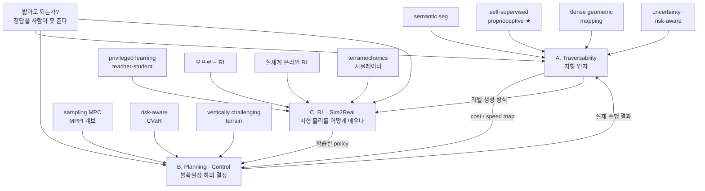
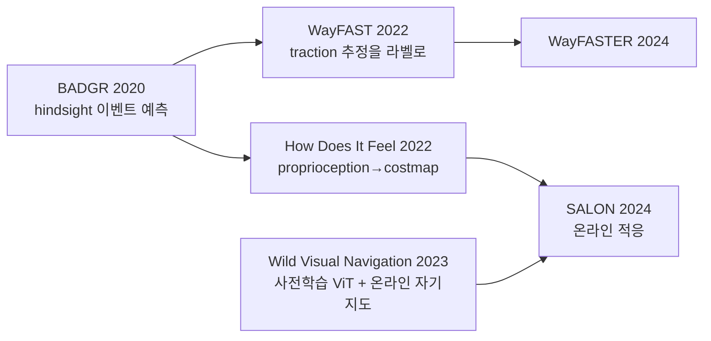
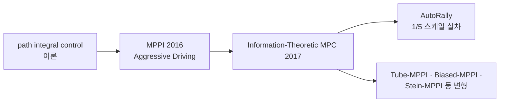

# 오프로드 지도

오프로드 자율주행 논문 아카이브의 최상위 지도.
새 논문을 정리하면 해당 축의 계보에 링크를 추가합니다.

> [!tip] 사용법
> 아직 안 읽은 논문은 **미해결 링크**(연한 색)로 남겨둡니다.
> 그래프 뷰에서 속이 빈 노드로 보이므로, **다음에 읽을 것**이 자동으로 보입니다.
>
> 처음이면 [[읽기 경로]]부터. 표기가 낯설면 [[용어 사전]].

> [!note] 표기
> ✅ = arXiv 번호·연도·저자를 직접 확인 · ⚠️ = 근거는 있으나 일부 미확인 · ❓ = 확인 못 함
> **확인 못 한 것은 비워둡니다. 그럴듯하게 채우지 않습니다.**

---

## 0. 왜 온로드와 다른 문제인가 ★

이 절이 이 지도의 전부입니다. 아래 6단계 사슬이 **이 분야가 지금 모양인 이유**를 설명합니다.
논문을 읽다 길을 잃으면 여기로 돌아오세요.

> [!abstract] 한 줄
> 오프로드에서는 **"밟아도 되는가"의 정답을 사람이 줄 수 없다.**
> 그래서 이 분야는 결국 **주행해 본 결과를 라벨로 되먹이는** 쪽으로 수렴했다.

**① 경계가 없다.**
차선도 연석도 없다. 온로드 인지의 중심 질문("어디가 차선인가")이 **성립하지 않는다.**
"도로"가 아니라 **비용장(cost field)** 을 추정하는 문제가 된다.

**② 기하만으로는 원리적으로 안 된다.**
높이 40 cm의 수풀은 밟고 지나가야 하고, 같은 높이의 바위는 피해야 한다.
점군의 높이·법선만 보는 고전적 장애물 검출로는 **구분이 불가능하다.**
→ 이것이 **비기하학적 장애물(non-geometric obstacle)** 문제이고, semantic이 들어오는 이유다.

> [!tip] RL 볼트에서 이미 만난 문제다
> RL 볼트 「프로젝트 스택」 부록 A-4에 *"cluster→분류→tracking 방식이 벽과 벽 구조물을 장애물로 오분류"* 라는
> 기록이 있다. **같은 실패의 훨씬 심한 버전**이 오프로드의 출발점이다.

**③ semantic으로도 부족하다.**
같은 "흙" 클래스라도 마른 흙과 젖은 진흙은 traction이 다르다.
[[Probabilistic Traversability (Cai 2022)]]의 문제 제기가 정확히 이것 —
*시각적으로 유사하거나 같은 semantic class인 지형도 traction이 실질적으로 다르다.*
→ **외부 감각(exteroception)만으로는 닫히지 않는다.**

**④ 그래서 proprioception이 들어온다.**
실제로 지나가 보면 진동·slip·전류·sinkage로 **지형이 응답**한다.
[[How Does It Feel (Castro 2022)]]의 제목이 바로 이 뜻이다.

**⑤ 라벨은 사람이 아니라 주행 결과가 준다 — self-supervision.**
"이 픽셀이 traversable한가"에 사람은 답할 수 없다. 로봇·속도·적재에 따라 답이 달라지기 때문이다.
그래서 **지나간 뒤에 되돌아보며(hindsight) 라벨을 붙인다.**
[[BADGR (Kahn 2020)]]이 이 구조를 확립했고, A-2 계열 전체가 그 위에 서 있다.

**⑥ traversability는 이진도 아니고, 플랫폼·속도에 종속이다.**
같은 자갈밭이 3 m/s에서는 통과 가능하고 8 m/s에서는 전복이다.
[[CAHSOR (2024)]]가 이걸 **competence-aware**로 명시화했다.
→ 논문의 성능 숫자를 옮길 때 **플랫폼·속도·지형을 반드시 같이 옮겨야 하는 이유.**

> [!danger] 여기서 파생되는 함정
> **slip이 예외가 아니라 상시 상태다.**
> 온로드 제어는 슬립을 이상 상황으로 다루지만, 오프로드에서는 정상 상태다.
> 명령과 실제 궤적이 **항상** 벌어지고, 그 간극의 크기가 지형마다 다르다.
> → B축(불확실성 하의 계획)과 C축(지형 물리 모델링)이 갈라져 나오는 지점.

---

## 1. 세 축 — 한눈에

---

## 2. A축 — Traversability / 지형 인지

### A-1. Semantic segmentation 계열 — "무엇인가"로 답하기

| 논문 | 확인 | 한 줄 |
|---|---|---|
| [[RUGD (Wigness 2019)]] | ✅ IROS 2019 · Wigness, Eum, Rogers, Han, Kwon (arXiv 없음) | 소형 무인 지상로봇이 비정형 환경을 주행하며 찍은 영상. **지형 종류가 훨씬 많고 클래스 경계가 불규칙**하며 구조화된 표식이 거의 없다 |
| [[RELLIS-3D (Jiang 2020)]] | ✅ `arXiv:2011.12954` · ICRA 2021 · Jiang, Osteen, Wigness, Saripalli | LiDAR 13,556 스캔 + 이미지 6,235장. **멀티모달**. 도심 데이터셋에서 학습한 모델이 깨지는 것을 보임. class imbalance와 지형 기복이 난점 |
| [[GANav (Guan 2021)]] | ✅ `arXiv:2103.04233` | 클래스가 아니라 **navigability 등급**으로 묶어 segmentation. group-wise attention. RUGD/RELLIS-3D에서 SOTA |

> [!warning] 이 계열의 천장
> semantic class는 **사람이 정의한 범주**다. §0-③ 때문에 traction과 일대일이 아니다.
> GANav가 클래스 대신 "등급"으로 묶은 것이 그 인정이고, A-2 계열이 아예 사람 라벨을 버린 이유다.

### A-2. Self-supervised · proprioceptive 계열 ★ — **이 분야의 주류**

| 논문 | 확인 | supervision이 무엇인가 |
|---|---|---|
| [[BADGR (Kahn 2020)]] | ✅ `arXiv:2002.05700` · Kahn, Abbeel, Levine | **주행하며 스스로 모은 off-policy 데이터.** 충돌·위치·지형 거칠기 같은 *미래 이벤트*를 예측하도록 학습하고, 그 예측으로 계획한다. 시뮬도 사람 감독도 없음 |
| [[WayFAST (Gasparino 2022)]] | ✅ `arXiv:2203.12071` · RA-L | **receding-horizon estimator가 추정한 traction 값**이 라벨. 휴리스틱 없이 RGB-D에서 traversable path 예측. 모래사장·숲·눈 덮인 초지에서 필드 테스트 |
| [[How Does It Feel (Castro 2022)]] | ✅ `arXiv:2209.10788` · ICRA 2023 | **exteroception(환경) + proprioception(지형 반응)** 을 결합해 costmap을 자기지도로 학습. costmap 파이프라인에 **로봇 속도를 넣는** 방식을 제안 |
| [[Wild Visual Navigation (Frey 2023)]] | ✅ `arXiv:2305.08510` · RSS 2023 | **짧은 사람 시연** 하나로 시작해 **온라인으로 계속 적응**. 자기지도 ViT feature 사용, 로봇 위에서 실시간. 필드에서 **5분 미만**에 부트스트랩 |
| [[WayFASTER (2024)]] | ✅ `arXiv:2402.00683` · ICRA 2024 | WayFAST 후속. 시간적 맥락을 넣어 navigation awareness 확장 |
| [[SALON (Sivaprakasam 2024)]] | ✅ `arXiv:2412.07826` · ICRA 2025 | **손 라벨 1개**에서 시작해 온라인으로 적응. 분포 밖 지형은 회피하면서 risk-aware cost·speed map 생성. 2랩째에 기존 SOTA와 동등 |

> [!important] 이 계열을 읽는 법
> **네트워크 구조는 거의 중요하지 않다.** 기여의 90%가 *"라벨을 어디서 만들어내는가"* 에 있다.
> 논문을 열면 supervision signal을 먼저 찾고, 그 다음에 아키텍처를 본다.
> → [[Self-Supervised Labeling]]

### A-3. Dense geometric mapping 계열 — 고속 주행용 표현

| 논문 | 확인 | 한 줄 |
|---|---|---|
| [[TerrainNet (Meng 2023)]] | ✅ `arXiv:2303.15771` | **고속 오프로드용** semantic + geometric 지형 예측. multi-head 출력으로 거친/세밀한 특징 동시 포착, self-supervised depth completion, 학습된 image feature projection으로 실시간 |
| [[RoadRunner (Frey 2024)]] | ✅ `arXiv:2402.19341` | 카메라+LiDAR에서 **traversability와 elevation map을 직접** 예측. 수작업 semantic class 분류에 의존하지 않고 **주행 데이터에서 hindsight로 생성한 라벨**로 end-to-end 학습 |
| [[RoadRunner M&M (2024)]] | ✅ `arXiv:2409.10940` | 다중 범위·다중 해상도 traversability map |
| [[Implicit Neural Traversability (2025)]] | ✅ `arXiv:2511.18183` | 지형 traversability의 implicit neural representation |

### A-4. Uncertainty · risk-aware 계열 — "얼마나 못 믿는가"

| 논문 | 확인 | 한 줄 |
|---|---|---|
| [[Probabilistic Traversability (Cai 2022)]] | ✅ `arXiv:2210.00153` · Cai, Everett · IROS 2023 | traction을 **분포**로 학습(unicycle dynamics의 traction 파라미터 경험분포). 최악의 기대 비용/traction 두 가지 risk-aware cost. **latent space density estimator**로 신뢰 못 할 지형을 검출해 회피 |
| [[EVORA (Cai 2023)]] | ✅ `arXiv:2311.06234` · Cai, Ancha, Sharma, Osteen, Bucher, Phillips, Wang, Everett, Roy, How · IEEE 2024 ⚠️학회명 미확인 | evidential deep learning으로 traversability를 학습. [[Probabilistic Traversability (Cai 2022)]]의 **같은 1저자 후속** |

> [!question] 관통하는 질문 — A축
> **"밟아도 되는가"의 라벨을 누가 주는가?**
> 사람(A-1) → 주행 결과(A-2) → 그리고 **그 결과조차 못 믿을 때 어떻게 하는가**(A-4).
> A-4는 A-2의 자연스러운 다음 질문이다. 자기지도 라벨은 **가 본 곳에서만 정확**하기 때문이다.

---

## 3. B축 — Planning · Control

### B-1. Sampling-based MPC — MPPI 계보

| 논문 | 확인 | 한 줄 |
|---|---|---|
| [[MPPI (Williams 2016)]] | ✅ ICRA 2016 · Williams, Drews, Goldfain, Rehg, Theodorou (arXiv 없음 ⚠️) | 궤적을 **확률적으로 샘플링**해 최적 제어를 구함. **미분이 필요 없어** 비선형 동역학·비볼록 비용을 그대로 다룬다. GPU 구현, 1/5 스케일 AutoRally 차량의 aggressive driving에 적용 |
| [[Information-Theoretic MPC (Williams 2017)]] | ✅ `arXiv:1707.02342` | free energy ↔ relative entropy 관계로 MPPI를 정보이론적으로 재유도. 학습된 동역학 모델과 결합 |
| [[RL-Compensated MPC (2024)]] | ✅ `arXiv:2408.09253` | **미지의 변형 지형**에서 MPC의 모델 오차를 RL이 보정. B축과 C축의 접점 |

> [!tip] RL 배경이 있으면 MPPI가 빨리 붙는다
> MPPI의 가중 평균 $u^* = \sum_k w_k u_k,\; w_k \propto \exp(-\tfrac{1}{\lambda} S_k)$ 는
> **soft-max over trajectories**다. RL 볼트의 maximum entropy RL에서 $\alpha$ 가 하던 역할을 $\lambda$ 가 한다.
> 차이는 **학습이 아니라 매 스텝 재샘플링**이라는 것.
> → [[MPPI]], [[Sampling-based MPC]]

### B-2. Risk-aware planning — 기댓값이 아니라 꼬리를 본다

| 논문 | 확인 | 한 줄 |
|---|---|---|
| [[STEP (Fan 2021)]] | ✅ `arXiv:2103.02828` · RSS 2021 · Fan, Otsu, Kubo, Dixit, Burdick, Agha-Mohammadi | ① 불확실성 인식 매핑 ② **CVaR(Conditional Value-at-Risk)로 꼬리 위험 평가** ③ SQP 기반 MPC로 kinodynamic 계획. 폐지하철·용암동굴에서 바퀴형·다리형 모두 검증 |
| [[STEP SubT (2023)]] | ✅ `arXiv:2303.01614` | 위 논문의 **DARPA Subterranean Challenge 실전 결과**판 |

> [!important] 왜 기댓값이 아니라 CVaR인가
> 오프로드에서 실패는 **평균적으로 조금 느려지는** 것이 아니라 **전복·매몰로 임무가 끝나는** 것이다.
> 비용 분포의 꼬리가 두껍고 비대칭이라 기댓값 최적화가 위험을 과소평가한다.
> CVaR은 상위 $\alpha$ 분위 **이상 구간의 조건부 기댓값** — 즉 "나쁜 경우들의 평균"을 본다.
> → [[CVaR]]

### B-3. Vertically challenging terrain — Verti 계열 (George Mason, Xuesu Xiao)

바위·급경사에서 **차체 자세(roll·pitch)까지 계획**해야 하는 극단. 플랫폼·데이터셋·알고리즘·벤치마크가 한 묶음으로 나온다.

| 논문 | 확인 | 한 줄 |
|---|---|---|
| [[Verti-Wheelers (2023)]] | ✅ `arXiv:2303.00998` | 오픈소스 플랫폼(V4W/V6W) + 데이터셋 + 알고리즘. **개조를 거의 안 한 평범한 바퀴 로봇도 수직으로 험한 지형을 지날 수 있다**는 것을 보임 |
| [[Learning to Model and Plan on VCT (2023)]] | ✅ `arXiv:2306.11611` | 바퀴-지형 상호작용 모델을 학습하고 그 위에서 계획 |
| [[CAHSOR (2024)]] | ✅ `arXiv:2402.07065` | **competence-aware** 고속 오프로드 주행 in SE(3). "이 지형에서 이 속도를 낼 수 있는가"를 명시적으로 다룸 |
| [[Terrain-Attentive Learning (2024)]] | ✅ `arXiv:2403.16419` | VCT에서의 효율적 **6-DoF kinodynamic** 모델링 |
| [[Verti-Bench (2025)]] | ✅ `arXiv:2502.11426` | VCT용 **일반적·확장 가능한 오프로드 mobility 벤치마크** |

> [!question] 관통하는 질문 — B축
> **예측이 불확실할 때 무엇을 최적화하는가?**
> 기댓값(B-1) → 꼬리 위험(B-2) → **그리고 애초에 무엇이 가능한지**(B-3, competence).
> A축이 "지도가 틀릴 수 있다"를 말하면, B축은 "틀릴 수 있는 지도로 어떻게 결정하는가"를 답한다.

---

## 4. C축 — RL / Sim-to-Real

### C-1. Privileged learning 계보 ★ — RL 볼트의 asymmetric AC와 같은 뿌리, 다른 가지

| 논문 | 확인 | 한 줄 |
|---|---|---|
| [[Learning Quadrupedal Locomotion (Lee 2020)]] | ✅ `arXiv:2010.11251` · Science Robotics 2020 · Lee, Hwangbo, Wellhausen, Koltun, Hutter | **teacher-student.** 시뮬에서 특권 정보를 보는 teacher를 먼저 학습시키고, proprioception만 보는 student가 증류받는다. 자연 지형으로 **zero-shot** 전이 |
| [[RMA (Kumar 2021)]] | ⚠️ `arXiv:2107.04034` (RL 볼트 로드맵 §5-2에서 인용) | privileged teacher → student 증류. adaptation module이 최근 이력에서 환경 파라미터를 추정 |

> [!danger] ★ 여기가 RL 볼트와 직접 이어지는 지점이다
> RL 볼트는 privileged 정보를 **asymmetric actor-critic**(Pinto 2017)으로 쓴다 —
> **critic만** 특권 관측을 받고 actor는 실차 관측만 받는다.
> locomotion 계보는 같은 문제를 **teacher-student 증류**로 푼다 —
> teacher가 특권 관측으로 *policy*를 만들고, student가 그것을 흉내낸다.
>
> | | asymmetric AC | teacher-student |
> |---|---|---|
> | 특권 정보가 들어가는 곳 | **critic** (value 추정) | **teacher policy** |
> | 학습 단계 | 1단계 | 2단계 |
> | 배포되는 것 | actor | student |
>
> **같은 문제의 두 답이다.** RL 볼트 로드맵 §5-2도 RMA를 *"asymmetric AC의 경쟁 접근"* 으로 적어뒀다.
> 오프로드/locomotion 문헌에서는 **teacher-student 쪽이 사실상 표준**이라는 것이 이 볼트에서 얻는 정보다.
> → [[Privileged Learning]]

### C-2. 오프로드 RL

| 논문 | 확인 | 한 줄 |
|---|---|---|
| [[RL for Wheeled Mobility on VCT (2024)]] | ✅ `arXiv:2409.02383` | VCT에서 **end-to-end RL**. 시뮬 시행착오로 바퀴-지형 상호작용을 학습 |
| [[VertiSelector (2024)]] | ✅ `arXiv:2409.17469` | **automatic curriculum learning** — 학습할 지형을 선택적으로 샘플링해 효율·일반화 향상 |
| [[VertiCoder (2024)]] | ✅ `arXiv:2409.11570` | VCT용 자기지도 kinodynamic **표현 학습** |
| [[Wheeled Lab (Han 2025)]] | ✅ `arXiv:2502.07380` · CoRL 2025 | **Isaac Lab 기반 오픈소스 1/10 RC카 sim2real 생태계.** domain randomization·센서 시뮬·E2E 학습. zero-shot 정책 3종: **controlled drifting**, elevation traversal, visual navigation |

> [!tip] Wheeled Lab은 양쪽 볼트에 걸쳐 있다
> RL 볼트 「프로젝트 스택」 §11이 이미 이 논문을 **"한계 거동 모델링이 가능하다는 증거"** 로 인용한다.
> 이 볼트에서는 **오프로드 지형(elevation traversal) 쪽**을 본다. 같은 논문, 다른 관점.

### C-3. 실세계 온라인 RL

| 논문 | 확인 | 한 줄 |
|---|---|---|
| [[FastRLAP (Stachowicz 2023)]] | ✅ `arXiv:2304.09831` · CoRL 2023 · Stachowicz, Shah, Bhorkar, Kostrikov, Levine | 시뮬도 전문가 시연도 없이 **실차에서 20분 온라인 학습**으로 공격적 주행 습득. 대규모 사전 데이터로 표현 초기화 + 저속 시연 1회로 코스 지정 + **충돌 시 자동 리셋**하며 자율 연습 |

> [!warning] FastRLAP이 진짜로 푼 문제는 "자율 연습"이다
> 알고리즘(sample-efficient off-policy RL)보다 **리셋 자동화**가 핵심 기여다.
> 실세계 RL이 안 되는 이유는 대개 학습이 아니라 **에피소드를 못 끊어서**다.
> RL 볼트의 Tier 3(실차)를 생각할 때 가장 직접적인 참조.

### C-4. 시뮬레이터 · terramechanics — **시뮬에 없는 물리는 배울 수 없다**

| 논문·도구 | 확인 | 한 줄 |
|---|---|---|
| [[Project Chrono]] · SCM | ⚠️ 검색 결과 기반, 논문 미확인 | **Soil Contact Model** — DLR이 개발, Bekker-Wong·Janosi-Hanamoto 반경험 모델의 일반화. 실시간 변형 지형. DEM(개별 입자)은 정확하지만 훨씬 무겁다 |
| [[Continuum Terramechanics (2025)]] | ✅ `arXiv:2507.05643` | 물리 기반 **연속체** terramechanics 모델. 확장성·속도 |
| [[TartanDrive (Triest 2022)]] | ✅ `arXiv:2205.01791` · ICRA 2022 | 개조 Yamaha Viking ATV, **7개 센싱 모달리티, 약 20만 건**의 오프로드 주행 상호작용. 오프로드 **동역학 모델 학습**용 데이터셋 |
| [[PIAug (2023)]] | ✅ `arXiv:2311.00815` | **physics-informed augmentation** — 오프로드 차량 동역학 학습용 데이터 증강 |

> [!danger] ★ RL 볼트 §8-5의 문제가 여기서 한 단계 더 나빠진다
> RL 볼트는 *"`f1tenth_gym`의 타이어 모델이 선형이라 포화가 없다 → 한계 거동을 Tier 1에서 배울 수 없다"* 로 끝난다.
> 오프로드는 그 위에 **지형 자체가 변형된다**는 층이 하나 더 붙는다.
> 강체 접촉 가정이 깨지고, sinkage·bulldozing·전단 파괴가 힘의 지배 항이 된다.
>
> **결론이 같다: 시뮬에 없는 현상은 randomization을 아무리 넓혀도 배울 수 없다.**
> 다만 오프로드에서는 그 "없는 현상"이 훨씬 크다.
> → [[Terramechanics]], [[Sim-to-Real Gap]]

> [!question] 관통하는 질문 — C축
> **지형-차량 상호작용을 어디까지 모델링할 것인가?**
> 모델링한다(C-4 terramechanics) ↔ 모델링을 포기하고 데이터로 때운다(C-2 randomization, C-3 실세계 학습).
> 이 트레이드오프가 C축 논문을 가르는 축이다.

---

## 5. 데이터셋 · 벤치마크

| 이름 | 확인 | 규모·특징 |
|---|---|---|
| [[RUGD (Wigness 2019)]] | ✅ IROS 2019 | RGB, 7,546 annotation, 24 클래스 ⚠️수치 미대조 |
| [[RELLIS-3D (Jiang 2020)]] | ✅ `arXiv:2011.12954` | LiDAR 13,556 스캔 + 이미지 6,235장, 스테레오·GPS·IMU. Texas A&M Rellis 캠퍼스 |
| [[TartanDrive (Triest 2022)]] | ✅ `arXiv:2205.01791` | ATV 주행 상호작용 약 20만 건, 7 모달리티. **동역학 학습용** |
| [[ORAD-3D (2025)]] | ✅ `arXiv:2510.16500` | 대규모 오프로드 자율주행 데이터셋 + 벤치마크 |
| [[Verti-Bench (2025)]] | ✅ `arXiv:2502.11426` | VCT mobility 벤치마크 |

> [!warning] 데이터셋 선택이 문제 정의를 결정한다
> RUGD·RELLIS-3D는 **semantic 라벨**이 있고 TartanDrive는 **주행 상호작용**이 있다.
> 전자를 쓰면 A-1로, 후자를 쓰면 A-2/C-4로 문제가 끌려간다. 데이터셋을 먼저 고르면 축이 정해진다.

---

## 6. 서베이 · 진입점

| 자료 | 확인 | 비고 |
|---|---|---|
| **Min et al., *Autonomous Driving in Unstructured Off-Road Environments: How Far Have We Come?*** | ✅ JFR 2026 · `10.1002/rob.70154` · arXiv 번호 ❓ | **250편 이상** 리뷰. 오프라인 매핑·pose 추정·인지·경로 계획·E2E·데이터셋 전반. [GitHub 목록](https://github.com/chaytonmin/Survey-Autonomous-Driving-in-Unstructured-Off-Road-Environments) 이 계속 갱신됨 — **이 볼트의 1차 색인으로 쓸 것** |
| *A Survey of Traversability Estimation for Mobile Robots* | ✅ `arXiv:2204.10883` | A축 전용 서베이 |
| Teji et al., *A Survey of Off-Road Mobile Robots: Slippage Estimation, Robot Control, and Sensing Technology* | ✅ JIRS 2023 · `10.1007/s10846-023-01968-2` | **slip 중심** 서베이. proprioceptive / exteroceptive / model-based slip 추정 분류. §0의 "slip은 상시" 주장의 근거 |
| Arafin et al., *Advances and Trends in Terrain Classification Methods for Off-Road Perception* | ✅ JFR 2025 (Wiley) | 지형 분류 방법론 정리 |

---

## 7. 최신 흐름 (읽지 않음, 위치만 표시)

| 자료 | 확인 | 비고 |
|---|---|---|
| [[Language-Guided Off-Road Planning (2026)]] | ✅ `arXiv:2604.21249` | VLM으로 traversability를 **추론**시키는 방향. *Reasoning About Traversability* |

> [!note] 이 절은 의도적으로 얇다
> 서베이 단계에서 최신 논문을 먼저 쫓으면 계보가 안 잡힌다.
> §2~4의 계보가 손에 들어온 뒤에 여기를 채웁니다.

---

## 8. RL 볼트와 이어지는 지점 ★

두 볼트는 분리되어 있지만 **문제가 겹칩니다.** 아래는 확인된 접점입니다.
(위키링크 금지 — 평문 참조)

| 오프로드 쪽 | RL 볼트 쪽 | 관계 |
|---|---|---|
| §0-② 비기하학적 장애물 | 「프로젝트 스택」 부록 A-4 — 벽/장애물 오분류 | **같은 실패의 심화판.** 그 팀이 겪은 문제가 이 분야의 출발점 |
| §4 C-4 terramechanics | 「프로젝트 스택」 §8-5 — 선형 타이어, 포화 없음 | **같은 결론**(시뮬에 없는 건 못 배운다), 오프로드가 한 단계 더 심각 |
| §4 C-1 teacher-student | 「RL 지도」 — Asymmetric Actor-Critic (Pinto 2017) | 특권 정보를 쓰는 **두 가지 방식**. 도메인마다 표준이 다름 |
| §4 C-2 VertiSelector | 「프로젝트 스택」 §10-5 — Two-Phase Curriculum | 둘 다 **automatic curriculum**. 전이 게이트 설계가 같은 문제 |
| §3 B-2 CVaR | 「프로젝트 스택」 §10-4 — $r_{\text{safety}}$, TTC | 안전을 **보상**으로 넣나 **제약**으로 넣나 |
| §4 C-2 Wheeled Lab | 「프로젝트 스택」 §11 — Tier 2 근거 | **같은 논문.** 저쪽은 drifting, 이쪽은 elevation traversal |
| §0 slip은 상시 | 「질문 로그」 — PP의 한계는 슬립을 관측하지 않아서 | **같은 진단.** 오프로드 문헌도 답이 같다: 관측(proprioception) + randomization |
| §4 C-3 FastRLAP | 「프로젝트 스택」 §11 — Tier 3 실차 | 실세계 온라인 학습의 가장 직접적인 참조 |

---

## 9. 아직 안 읽은 것 — 미해결 링크 색인

그래프 뷰에서 빈 노드로 보이는 것들. **이게 곧 할 일 목록입니다.**

**논문**
[[BADGR (Kahn 2020)]] · [[WayFAST (Gasparino 2022)]] · [[How Does It Feel (Castro 2022)]] ·
[[Wild Visual Navigation (Frey 2023)]] · [[SALON (Sivaprakasam 2024)]] · [[WayFASTER (2024)]] ·
[[TerrainNet (Meng 2023)]] · [[RoadRunner (Frey 2024)]] · [[RoadRunner M&M (2024)]] ·
[[Implicit Neural Traversability (2025)]] · [[GANav (Guan 2021)]] · [[RELLIS-3D (Jiang 2020)]] ·
[[RUGD (Wigness 2019)]] · [[Probabilistic Traversability (Cai 2022)]] · [[EVORA (Cai 2023)]] ·
[[MPPI (Williams 2016)]] · [[Information-Theoretic MPC (Williams 2017)]] · [[RL-Compensated MPC (2024)]] ·
[[STEP (Fan 2021)]] · [[STEP SubT (2023)]] · [[Verti-Wheelers (2023)]] ·
[[Learning to Model and Plan on VCT (2023)]] · [[CAHSOR (2024)]] · [[Terrain-Attentive Learning (2024)]] ·
[[Verti-Bench (2025)]] · [[Learning Quadrupedal Locomotion (Lee 2020)]] · [[RMA (Kumar 2021)]] ·
[[RL for Wheeled Mobility on VCT (2024)]] · [[VertiSelector (2024)]] · [[VertiCoder (2024)]] ·
[[Wheeled Lab (Han 2025)]] · [[FastRLAP (Stachowicz 2023)]] · [[TartanDrive (Triest 2022)]] ·
[[PIAug (2023)]] · [[ORAD-3D (2025)]] · [[Continuum Terramechanics (2025)]] · [[Project Chrono]] ·
[[Language-Guided Off-Road Planning (2026)]]

**개념**
[[Traversability]] · [[Self-Supervised Labeling]] · [[Slip]] · [[Terramechanics]] · [[CVaR]] ·
[[MPPI]] · [[Sampling-based MPC]] · [[Elevation Map]] · [[Privileged Learning]] · [[Sim-to-Real Gap]] ·
[[Evidential Deep Learning]] · [[Domain Randomization]] · [[Curriculum Learning]]

---

## 🔗 연결

- [[읽기 경로]] — 무엇부터 읽을지
- [[용어 사전]] — 이 분야 표기 대조표
- [[질문 로그]] — 지금까지 나온 질문 전체
