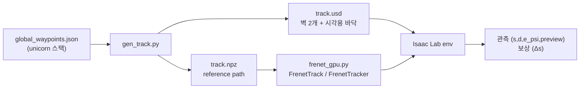

# 트랙 생성 · Frenet 변환

> [!abstract] 한 줄
> unicorn 스택의 `global_waypoints.json` 하나로 **Isaac Sim 용 벽 USD** 와
> **RL 용 reference path** 를 동시에 만든다. 그리고 그 경로 위로
> $(x,y,\psi) \to (s, d, e_\psi)$ 를 **256 env 동시에** 변환한다.

> [!info] 위치
> [[ML 서버 · Isaac Sim 환경]] 에서 환경이 서고 [[차량 모델링 (URDF)]] 에서 차가 생긴 다음,
> **env 를 쓰기 위해 반드시 있어야 하는 두 조각**이다.
> 개념은 [[Frenet Frame]], 목표 아키텍처는 [[프로젝트 스택]] §10.



---

## 1. 입력 — 어느 waypoint 를 쓸 것인가

`global_waypoints.json` 에는 세 종류가 들어 있다. **IQP 만 쓸 수 있다.**

| 소스 | 폐곡선 gap | 자기교차 | 판정 |
|---|---|---|---|
| `global_traj_wpnts_iqp` | **0.0000 m** | **0 건** | ✅ 사용 |
| `centerline_waypoints` | 0.26~0.47 m | 35~47 건 | ❌ |
| `global_traj_wpnts_sp` | — | $|\kappa|$ 최대 213 ($R$ = 5 mm) | ❌ |
| `trackbounds_markers` | — | **순서 없는** sphere marker 3,404 개 | ❌ 메시로 못 씀 |

> [!warning] 마지막 점이 첫 점과 중복이다
> 실측 거리 0.0000 m. 떨어내지 않으면 메시에 **퇴화(degenerate) 면**이 생긴다.

## 2. 경계 복원 — marker 가 아니라 $d_{\text{left}}/d_{\text{right}}$ 로

$$\mathbf{L} = \mathbf{p} + d_{\text{left}}\,\mathbf{n}, \qquad
\mathbf{R} = \mathbf{p} - d_{\text{right}}\,\mathbf{n}, \qquad
\mathbf{n} = (-\sin\psi,\ \cos\psi)$$

```
                     ifac_0824_mapping_3    ifac_roboracer
점 수 / 랩 길이        422 / 42.1738 m        414 / 41.3013 m
ds (완전 균일)         0.099938 m             0.099762 m      (float64 표준편차 2e-15)
자기교차 (두께 포함)   0                      0
여유 min(R − offset)   1.0022 m               —
가장 좁은 곳           0.926 m                —
```

## 3. 벽 메시 — 세 가지 함정

> [!danger] ① `approximation = "convexHull"` 은 트랙을 통째로 막는다
> 42 m 폐루프의 convex hull 은 **트랙 전체를 메우는 덩어리**다.
> `approximation = "none"` (triangle mesh) 만 맞다.
> 그리고 PhysX 의 triangle mesh collider 는 **정적 바디만** 지원하므로
> `RigidBodyAPI` 를 붙이면 안 된다.

> [!danger] ② zero-thickness 면은 한쪽에서만 충돌한다
> 법선 방향에 따라 반대쪽에서 통과한다. 두께 0.05 m 의 **닫힌 volume** 으로 만든다.
> 안쪽으로 접히는지는 `min(R − offset)` = 1.00 m 로 확인했다.

> [!danger] ③ winding 을 손으로 따지면 틀린다
> 부호 있는 부피 $V = \frac{1}{6}\sum \mathbf{p}_0 \cdot (\mathbf{p}_1 \times \mathbf{p}_2)$
> 를 계산해 음수면 전부 뒤집는다. 그리고 **모든 유향 간선이 정확히 한 번**씩
> 나타나는지로 watertight 을 검사한다.

```
left   정점 1,688  삼각형 3,376  부피 0.3911 m³   watertight 중복0 짝없음0 ✅
right  정점 1,688  삼각형 3,376  부피 0.5027 m³   watertight 중복0 짝없음0 ✅
USD 52,526 B   NPZ 24,302 B
```

## 4. reference path (`.npz`)

| 키 | shape | 용도 |
|---|---|---|
| `s, x, y, psi, kappa` | (N,) | 경로 기하 — **policy 관측의 출처** |
| `d_left, d_right` | (N,) | 코리도 반폭 → 벽 여유, 스폰 범위 |
| `left_bound, right_bound` | (N,2) | 벽 메시와 동일한 점열 (디버그·시각화) |
| `vx_planner` | (N,) | ⚠️ **Pure Pursuit 베이스라인 전용** |
| `ds, lap_length` | scalar | 균일 격자 · 랩 경계 |
| `preview_ds, preview_n, preview_stride` | scalar | 40 × 0.5 m = **20 m** |

> [!warning] `vx_planner` 를 policy 관측에 넣지 않는다
> 이 값은 `ggv.csv` 에서 나오는데 **19 행 전부 `5.0, 4.5` 로 동일**하다 (0~72 m/s).
> 즉 속도 프로파일이 실측이 아니라 자리표시자다. IQP 에서 **경로 형상만** 가져오고
> 속도는 policy 가 스스로 배우게 하는 근거가 이것이다 ([[프로젝트 스택]] §결정로그).
> 그래도 npz 에 남겨두는 이유는 **PP 베이스라인이 저마찰에서 무너지는 것**을
> 보여주는 대조 실험에 필요하기 때문이다.

> [!note] preview 지평선 20 m 의 근거
> 12 m/s, $\mu$ = 0.4 의 제동거리가 $v^2/(2\mu g)$ = **17.69 m** 다.
> 처음에 2 m (20점 × 10 cm) 로 잡았던 것은 **10배 부족**했다.

## 5. Frenet projector

```python
from frenet_gpu import FrenetTrack, FrenetTracker
trk = FrenetTrack("/workspace/assets/tracks/ifac_0824_mapping_3.npz", device="cuda:0")
st  = FrenetTracker(trk, num_envs=256)

o = st.reset(ids, xy, psi, s0=s_spawn)   # s 를 알면 전역 탐색을 건너뛴다
o = st.step(xy, psi)                     # s, d, e_psi, kappa, d_left, d_right, ds, s_total
pv = trk.preview(o["s"], xy, psi)        # 차량 좌표계 (B, 40): x, y, psi, kappa, d_left, d_right
p, yaw = trk.point_at(s, d)              # 스폰 위치 무작위화
```

### 설계 결정 네 개

| # | 결정 | 근거 |
|---|---|---|
| 1 | **증분(windowed) 탐색** ±12 index (±1.2 m) | 연산량 17배 + 맵 의존성 제거. 12 m/s·50 Hz 면 한 step 0.24 m 라 5배 여유. **3 m 이상 키우면 안 된다** — 먼 branch 가 후보에 들어온다 |
| 2 | waypoint 대신 **선분**에 투영 | waypoint 최근접은 오차 $ds/2$ = 5 cm (반폭의 2.5%) |
| 3 | 랩 카운트를 **누적거리**에서 계산 | $s\approx0$ 스폰 시 reset 의 $s$ 가 $L-\epsilon$ 로 나와 **허수 랩**이 잡힌다 (검증에서 실제로 2 가 나왔다) |
| 4 | `point_at` 은 **chord 법선**으로 오프셋 | `project` 의 정확한 역함수가 되어 벽 여유 검사가 어긋나지 않는다. $\psi$ 법선과의 차이는 반폭 끝에서 최대 60~76 mm |

### 검증 결과 (`test_frenet_gpu.py`, 두 맵 전부 ✅)

```
                              ifac_0824_mapping_3   ifac_roboracer
1 접힘 |kappa|×안쪽반폭             0.3078 < 1          0.3803 < 1
2 전역 안전조건 위반                81 / 422            218 / 414   (pessimistic)
3a float64 기준값 |Δd|              1.5e-07 m           1.9e-07 m
   float64 기준값 |Δs|              3.3e-05 m           7.6e-03 m   (코너 무승부 1/4096)
3b 왕복 |Δd| / |Δs|                 0.58 / 24.0 mm      0.71 / 29.4 mm
4 전역 locate 최대 |Δs|             0.024 m             통과
5 1.5랩 추적 Δs 누적오차            0.0000 m            0.0000 m
  window 경계 접촉                  0 회                0 회
6 preview 지평선 / k=0 스냅         20.0 m / 49.8 mm    20.0 m
7 랩 경계 Δs                        ±0.1000 m           ±0.1000 m
```

> [!tip] 구현 최적화 — 커널 실행 오버헤드가 지배한다
> 테이블이 422 행뿐이고 $B$ 도 작아서 **연산량이 아니라 op 개수**가 비용이다.
> `[x, y, seg_x, seg_y, |seg|²]` 처럼 미리 쌓아두면 gather 가 **15회 → 3회**로 줄고
> 이후 슬라이싱은 view 라 공짜다.

> [!warning] GPU 처리량은 아직 안 쟀다
> 로컬 CPU 수치(256 env 1.7 ms)는 이 머신의 gather 1회 ≈ 77 µs 에 묶인 값이라 의미가 없다.
> 서버에서 `--device cuda:0 --bench-envs 4096` 으로 다시 재야 한다.

## 6. 실행

```bash
# 트랙 생성 (컨테이너 — pxr 필요)
cd /workspace/IsaacLab
./isaaclab.sh -p /workspace/tools/gen_track.py /workspace/maps/ifac_0824_mapping_3 \
    --out-dir /workspace/assets/tracks

# Frenet 검증 (pxr 불필요 — torch 만)
./isaaclab.sh -p /workspace/tools/test_frenet_gpu.py \
    /workspace/assets/tracks/ifac_0824_mapping_3.npz --device cuda:0 --bench-envs 4096
```

⚠️ 실행 전 `gpu take 8g --gpu 0` ([[ML 서버 · Isaac Sim 환경]] §8)

## 7. 남은 것

- [ ] GPU 처리량 측정 (`--device cuda:0`, 256 / 1024 / 4096 env)
- [ ] **Pure Pursuit 베이스라인** (`tools/test_track_drive.py`) — 트랙 검증 + 대조군.
      스택의 실제 동작인 $0.8 \times$ `vx_planner` 를 쓰고 $\mu$ 를 낮춰가며 무너지는 지점을 찾는다
      (예측: $\mu \approx 0.42$ 아래에서 실패)
- [ ] `ifac_roboracer` 는 **미학습 테스트 트랙**으로 격리 — 학습에 쓰지 않는다
- [ ] 물리 `dt ≤ 1/120` 확인 — 1/60 이면 10 m/s 에서 step 당 16.8 cm 로
      차폭 20 cm 대비 **벽 tunneling** 위험
- [ ] 벽 두께 0.05 m 가 PhysX contact offset 과 충돌하지 않는지 확인

---

## 🔗 연결

- [[Frenet Frame]] — 좌표계 개념과 실패 모드
- [[ML 서버 · Isaac Sim 환경]] — 컨테이너·GPU 예절·시각화
- [[차량 모델링 (URDF)]] · [[URDF 와 USD]] — 차량 쪽
- [[프로젝트 스택]] §9-3 (스택의 `frenet_conversion`) · §10 (목표 아키텍처) · §14 (마일스톤)
