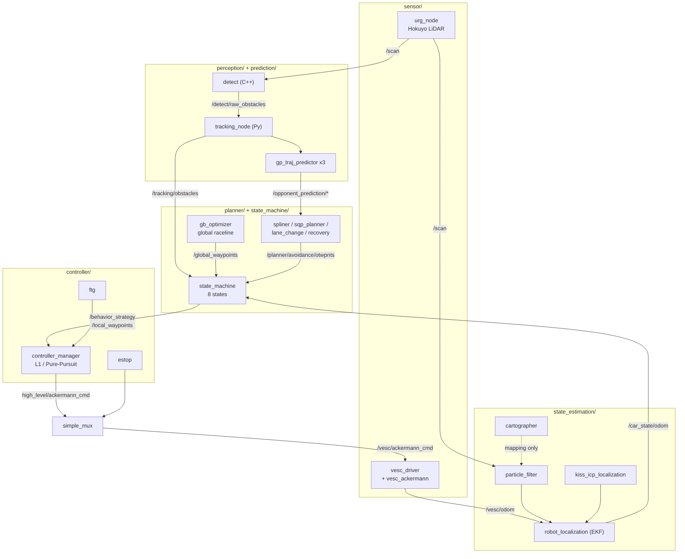
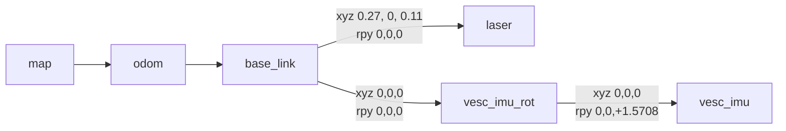
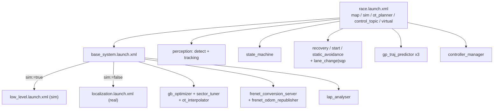

# 프로젝트 스택 정리

현재 진행 중인 **RL 기반 자율주행 레이싱** 프로젝트의 스택 전체 지도.
학습 로드맵은 [`docs/RL_ROADMAP.md`](../docs/RL_ROADMAP.md), 논문 계보는 [[RL 지도]].

> [!abstract] 한 줄
> [`HMCL-UNIST/unicorn-racing-stack`](https://github.com/HMCL-UNIST/unicorn-racing-stack)은
> **ROS 2 Jazzy 기반 F1TENTH 자율주행 레이싱 풀스택**이다.
> `perception → tracking → prediction → planning → state machine → control` 전체를 rule-based로 구현하고,
> **`f1tenth_gym`을 submodule로 내장**해 하드웨어 없이 SIL 테스트가 된다.
> 이 중 **control 계층(그리고 검토 결과에 따라 planning 일부)을 학습된 policy로 대체**하는 것이 목표.

> [!danger] ⚠️ 아키텍처 방향이 이동했다 — 읽기 전에 확인
> 이 노트는 원래 **순수 E2E**(LiDAR → policy → 조향·속도, planning 전체 대체) 전제로 시작했으나,
> 저장소 조사와 선행연구 검토를 거쳐 **trajectory-conditioned hierarchical** 쪽으로 결론이 기울었다.
> 근거·경위는 [[#13. 결정 로그]]. §9 판정표는 **두 방향을 병기**한다.
>
> `docs/RL_ROADMAP.md`는 아직 순수 E2E 전제로 쓰여 있어 §9·§4와 어긋난다.

> [!note] 표기
> ✅ = 저장소 소스·config·launch에서 **직접 확인** · ⚠️추정 = 근거는 있으나 미검증 · ❓ = 확인 못 함
> 확인 못 한 것은 **비워둔다.** 그럴듯하게 채우지 않는다.

---

## 1. 전체 구조



| 계층 | 패키지 |
|---|---|
| 센서 드라이버 | `sensor/urg_node`, `sensor/vesc`, `sensor/elrs_joy`, `sensor/transport_drivers` |
| State estimation | `state_estimation/{cartographer, cartographer_ros, particle_filter, kiss_icp_localization}` + `robot_localization`(외부) |
| Perception | `perception/` |
| Prediction | `prediction/gp_traj_predictor` |
| Planning | `planner/{gb_optimizer, spliner, spliner_planner, sqp_planner, lane_change_planner, recovery_spliner}` |
| Behavior | `state_machine/` |
| Control | `controller/` |
| 유틸 | `race_utils/{f110_msgs, f110_utils, raycaster, unicorn_gym, odom_calib, pitwall}` |
| 오케스트레이션 | `stack_master/` |

---

## 2. 하드웨어 · 플랫폼

| 구성 | 사양 | 비고 |
|---|---|---|
| 섀시 | **1/8 scale Serpent SRX8 R** | ⚠️ 저장소 파라미터는 전부 **1/10 F1TENTH** — §6 참조 |
| LiDAR | Hokuyo, **이더넷** `192.168.0.10:10940` ✅ | `urg_node`. `angle_min/max = ∓3.14` 요청 ✅ |
| 구동·조향 | VESC 6MK VI HP (ESC + HV 디지털 서보) | `/dev/ttyACM0` ✅ |
| IMU | VESC 내장 | 차체 기준 **yaw +90° 장착** ✅ |
| 컴퓨트 | Jetson Orin Nano | Tier 3 추론. **TensorRT 필수** |
| 배터리 | 2S × 2 LiHV | 전압 sag → 가속 randomization 대상 |

### VESC 캘리브레이션 ✅ — ESC duty ↔ 속도 매핑은 여기 있다

`stack_master/config/CAR/vehicle_config.yaml`

| 파라미터 | 값 | 의미 |
|---|---|---|
| `speed_to_erpm_gain` | `4614.0` | m/s → ERPM |
| `speed_to_erpm_offset` | `0.0` | |
| `steering_angle_to_servo_gain` | `-1.2135` | rad → servo `[0,1]` |
| `steering_angle_to_servo_offset` | `0.5304` | 중립 servo 값 |
| `speed_max / min` | `±23250.0` ERPM → **약 ±5.04 m/s** | `23250 / 4614` |
| `wheelbase` | `0.33` m | ⚠️ 1/10 값 |

> [!tip] 캘리브레이션 도구가 이미 있다
> `stack_master/launch/vesc_calibration.launch.xml` + `race_utils/odom_calib/` ✅
> 1/8 차량으로 바꾸면 위 gain/offset을 **전부 재측정**해야 하고, 그 도구가 이것이다.

### TF 트리 ✅

`stack_master/config/CAR/static_transforms.yaml` — `stack_master/scripts/static_tf_publisher.py`가 발행,
`low_level.launch.xml`에서 실행 (파일 주석 ✅).



| transform | xyz [m] | rpy [rad] |
|---|---|---|
| `base_link → laser` | `[0.27, 0.0, 0.11]` | `[0, 0, 0]` |
| `base_link → vesc_imu_rot` | `[0, 0, 0]` | `[0, 0, 0]` (**병진 전용**) |
| `vesc_imu_rot → vesc_imu` | `[0, 0, 0]` | `[0, 0, **+1.5707963**]` (**회전 전용**) |

> [!warning] 이전 판의 TF 트리를 정정한다
> 이전 노트는 `vesc_imu → vesc_imu_rot (yaw = −90°)` 로 **부모·자식과 부호가 반대**로 적혀 있었다.
> 실제 config는 `base_link → vesc_imu_rot`(병진만) → `vesc_imu`(**yaw +90°**) 순이고,
> 파일 주석이 그 이유를 명시한다 — *"각 quantity를 한 번씩만 지정 (중복된 +90/−90 쌍 없음)"*.
>
> **RL 관측에 IMU를 넣는다면 이 체인을 시뮬과 실차에서 동일하게** 적용해야 한다.

> [!question] 확인 필요
> `map → odom → base_link`를 **어느 노드가 발행하는지** 미확인.
> `localization.launch.xml`을 읽지 않았다. `localization:=gt|cartographer|pf` 세 모드의 노드 구성도 미확인.

### 실차 vs 시뮬 ✅

| | CAR (`sim:=false`) | SIM (`sim:=true`) |
|---|---|---|
| config 폴더 | `stack_master/config/CAR/` | `stack_master/config/SIM/` |
| 선택 | `race.launch.xml`의 `racecar_version` let 변수 | 동일 |
| 센서 | `urg_node` + `vesc_driver` | `gym_bridge`가 `/scan`, `/car_state/odom`, `/map`, `map→base_link` TF 제공 |
| localization | `cartographer` 또는 `pf` | `gt` (ground truth) |
| 상대 차량 | 기본 없음 (`virtual:=true`로 LiDAR에 오버레이 가능) | `virtual_perception`이 가상 상대 주입 (기본 on) |

> [!danger] CAR와 SIM의 `vehicle_config.yaml`·`dynamics.yaml`이 **바이트 단위로 동일**하다 ✅
> 실차 파라미터가 아직 측정되지 않았다는 뜻. §6·§11 참조.

---

## 3. 소프트웨어 기반

| 계층 | 구성 |
|---|---|
| 미들웨어 | **ROS 2 Jazzy**, `colcon build --symlink-install` (Release) |
| 개발환경 | **RoboStack(conda)** — `environment.yml` → env `unicorn`. **유일하게 검증된 경로** ✅ |
| 진입 | `unicorn` alias = `source unicorn.sh`. `PYTHONNOUSERSITE=1`, **CycloneDDS 강제**, `ROS_DOMAIN_ID=1`, 헬퍼 `cbuild` / `ros2kill` ✅ |
| 미지원 | System ROS 2 (apt/rosdep), Docker — README에 *"not yet tested"* 명시 ✅ |
| Tier 1 시뮬 | `race_utils/unicorn_gym` → `f1tenth_gym` (pip `f110_gym` v0.3.0) |
| Tier 2 시뮬 | Isaac Sim / Isaac Lab (미착수) |

> [!warning] CycloneDDS가 강제인 이유 ✅
> `unicorn.sh` 주석: 기본 FastDDS는 이 노드 그래프(~22개 노드)에서 **코어를 busy-spin으로 태워 ~22 Hz까지 떨어진다.**
> CycloneDDS는 ~21% CPU로 **~80 Hz**를 낸다. `RMW_IMPLEMENTATION`은 `conda activate` **이후**에 설정돼야 한다.

### Submodule ✅ (`.gitmodules`)

```bash
git clone --recursive https://github.com/hmcl-unist/unicorn-racing-stack.git
# 이미 받았다면
git submodule update --init --recursive
```

| path | url |
|---|---|
| `race_utils/raycaster` | `jeongsang-ryu/2D-RayCaster` |
| `race_utils/unicorn_gym` | `jeongsang-ryu/unicorn-gym` |
| `state_estimation/kiss_icp_localization` | `freshleesh/kiss_icp_localization` |

> [!danger] `--recursive` 없이 clone하면 **시뮬레이터 자체가 없다**

### 주요 외부 의존성 ✅

| 의존성 | 설치 | 용도 |
|---|---|---|
| `f110_gym` v0.3.0 | `pip install -e race_utils/unicorn_gym/f1tenth_gym` | Tier 1 시뮬 |
| `range_libc` | `pip install --no-build-isolation -e race_utils/raycaster/range_libc/pywrapper` | ray casting (시뮬 + PF 공용) |
| `quadprog=0.1.13` | conda (pip 버전 제거 후 — **반드시 마지막**) | planner |
| `asio=1.29.0` 핀 | conda | `transport_drivers`가 `asio::io_service` 사용 (asio ≥1.30에서 제거됨) |
| ros-jazzy | `cartographer-ros`, `nav2-*`, `robot-localization`, `foxglove-bridge`, `rosbag2-storage-mcap` | |

### ForzaETH와의 차이

| | 확인된 사실 |
|---|---|
| 계보 | ROS 1(catkin) 스택이 `ros1` 브랜치에 동결. `f110_utils`, `sector_tuner`, `spliner`, `gb_optimizer` 등 모듈명이 ForzaETH와 동일 ✅ |
| 미포팅 | ROS 1의 `dynamic_reconfigure` sector 서버(`sector_server`/`ot_sector_server`). 대신 `sector_tuner`/`ot_interpolator`가 맵 yaml을 직접 로드 ✅ |
| 추가됨 | `race_utils/unicorn_gym`, `race_utils/raycaster`, `kiss_icp_localization`, `virtual_perception` ✅ |

> [!question] ForzaETH 원본과의 정밀 diff는 수행하지 않았다.

---

## 4. 패키지 맵 ★

### 4.1 `race_utils/`

#### `race_utils/unicorn_gym` (submodule)

| 항목 | 내용 |
|---|---|
| 경로 | `race_utils/unicorn_gym/` → `f1tenth_gym/`, `f1tenth_gym_ros/`, `virtual_perception/` |
| 역할 | Tier 1 시뮬레이터 + ROS bridge + 가상 상대차 주입 |
| 핵심 노드 | `f1tenth_gym_ros` 의 `gym_bridge` |
| Subscribe ✅ | `vesc/ackermann_cmd`(ego drive), `opp_drive`, `/global_waypoints`(`WpntArray`), ego/opp reset, `remove_opp`, `opp_speed`, `opp_lidar`, static/dynamic obstacle 주입, teleop |
| Publish ✅ | `scan`(`LaserScan`), `car_state/odom`(`Odometry`), `/vesc/odom`(fake), `opp_scan`, `opp_odom`, `/map`(`OccupancyGrid`) |
| 핵심 config | `stack_master/config/SIM/sim.yaml` |
| 비고 | 상세는 [[#8. 시뮬레이션 — unicorn_gym / f1tenth_gym ★]] |

#### `race_utils/raycaster` (submodule)

| 항목 | 내용 |
|---|---|
| 경로 | `race_utils/raycaster/` — `raycaster.py`, `range_libc/`, `examples/`, `benchmark/` |
| 역할 | 2D occupancy grid ray casting. **시뮬과 particle filter가 공유** |
| API ✅ | `RaycastEngine(backend="rm", max_range_m, theta_disc)` <br> `.load_map_yaml(path) → (occ, res, origin)` <br> `.set_map(occ, res, origin)` <br> `.scan(pose_xyt, num_beams, fov) → ranges` <br> `.scan_with_dynamics(pose, num_beams, fov, opp_poses=…)` ← **상대차 박스 오버레이** <br> `.calc_range_repeat_angles(particles_xyt, angles)` ← particle filter용 <br> `.save_lut()` / `.load_lut()` |
| 비고 ✅ | 루트에 `COLCON_IGNORE` — **ROS 패키지가 아니라 순수 python 라이브러리.** 학습 루프에서 바로 import 가능 |

#### `race_utils/f110_utils/libs/frenet_conversion`

| 항목 | 내용 |
|---|---|
| 경로 | `race_utils/f110_utils/libs/frenet_conversion/` (C++ `.cc` + Python `frenet_converter.py`) |
| 역할 | Cartesian ↔ Frenet $(s, d)$ 변환 |
| Python API ✅ | `FrenetConverter(waypoints_x, waypoints_y, waypoints_psi=None)` <br> `get_frenet(x, y, s=None) → (s, d)` <br> `get_approx_s(x, y)` / `get_closest_index(x, y)` <br> `get_frenet_velocities(vx, vy, theta) → (vs, vd)` <br> `get_cartesian(s, d)` / `get_derivative(s)` <br> **`get_epsi(x, y, yaw) → float`** |
| 비고 | **순수 numpy. ROS 의존성 없음** → 학습 루프에서 직접 사용 가능 |

#### `race_utils/f110_utils/nodes/lap_analyser`

| 항목 | 내용 |
|---|---|
| 역할 | lap time, lateral error, 트랙 경계까지 최소거리 통계 |
| 핵심 노드 | `lap_analyser` (`base_system.launch.xml`에서 항상 실행 ✅) |
| Subscribe ✅ | `/state_marker`(`Marker`), `/global_waypoints`(`WpntArray`), `/car_state/odom_frenet`(`Odometry`), `/car_state/odom`(`Odometry`), `/lap_analyser/start`(`Empty`) |
| Publish ✅ | `lap_data`(`LapData`), `min_car_distance_to_boundary`(`Float32`), `lap_data_vis`/`lap_marker`(`Marker`) |
| 핵심 로직 ✅ | `check_for_finish_line_pass(current_s)` — Frenet $s$ 기준 랩 경계 통과 <br> `get_distance_to_boundary(current_d, d_left, d_right)` |

#### `race_utils/f110_utils/` 기타 ✅

| 경로 | 역할 |
|---|---|
| `libs/grid_filter` | 점유격자 필터 (C++/Py). **맵에 있는 것 제거 = 정적/동적 판별 1단계** ⚠️추정 |
| `libs/polygon_filter` | 트랙 경계 폴리곤 밖 제거 (C++) ⚠️추정 |
| `libs/vel_planner` | 속도 프로파일 |
| `nodes/frenet_conversion_server` | Frenet 변환 **서비스** (`convert_glob2frenetarr` / `convert_frenet2globarr`) |
| `nodes/frenet_odom_republisher` | `/car_state/odom` → `/car_state/odom_frenet` |
| `nodes/sector_tuner` | `speed_scaling.yaml` → `/global_waypoints_scaled`, `/sector_markers` |
| `nodes/overtaking_sector_tuner` | `ot_sectors.yaml` → `/global_waypoints/overtaking` |

#### `race_utils/f110_msgs` ✅

`BehaviorStrategy`, `CarState`, `CarStateStamped`, `GapData`, `LapData`, `OTWpntArray`, `Obstacle`, `ObstacleArray`, `OppWpnt`, `OpponentTrajectory`, `PidData`, `Prediction`, `PredictionArray`, `ProjOppPoint`, `ProjOppTraj`, `Wpnt`, `WpntArray`

**`Wpnt.msg`** — RL 관측 설계의 핵심. 필요한 값이 **거의 다 계산되어 들어있다**:
```
int32   id
float64 s_m, d_m            # Frenet
float64 x_m, y_m            # map
float64 d_right, d_left     # 트랙 경계까지
float64 psi_rad
float64 kappa_radpm         # ← 곡률. 직접 미분할 필요 없음
float64 vx_mps              # ← 목표 속도
float64 ax_mps2             # ← 목표 가속도
```

**`Obstacle.msg`** — **`bool is_static` 필드가 이미 존재.** `vs, vd`(Frenet 속도) + `vs_var, vd_var`(분산),
`s_start/s_end`, `d_left/d_right`, `is_visible`, `sector_id`, fixed-path 좌표 세트까지.

**`BehaviorStrategy.msg`** — `Wpnt[] local_wpnts`, `bool need_vel_planner`, `string state`, `Obstacle[] overtaking_targets`, `Obstacle[] trailing_targets`

### 4.2 `state_estimation/`

| 경로 | 역할 | 상태 |
|---|---|---|
| `cartographer/`, `cartographer_ros/` | 2D SLAM — 맵 생성. `mapping_2d.lua` / `localization_2d.lua` | ✅ 존재 / 토픽 ❓ |
| `particle_filter/` | MCL localization. `pf.yaml` | ✅ 존재 / 토픽 ❓ |
| `kiss_icp_localization/` (submodule) | KISS-ICP localization. `kiss.yaml` | ✅ 존재 / 토픽 ❓ |
| EKF | `robot_localization`(외부). `ekf_pf.yaml` / `ekf_cartographer.yaml` | ✅ config 확인 |

> [!question] `localization.launch.xml` 미독
> 세 모드에서 각각 어느 노드가 뜨고 `/car_state/odom`을 누가 발행하는지 미확인.
> **`kiss_icp`는 `localization:=` 인자 목록(`gt|cartographer|pf`)에 없다** — 어떻게 선택하는지 미확인.

### 4.3 `perception/`

| 항목 | 내용 |
|---|---|
| 경로 | `perception/src/detect.cpp`, `include/detect.h`, `scripts/multi_tracking.py` |
| 역할 | LiDAR 장애물 검출(C++) + 다중 객체 추적(Python) |
| 핵심 노드 ✅ | `detect`, `tracking_node` |
| 데이터 흐름 ✅ | `/scan` → **`detect`** → `/detect/raw_obstacles` → **`tracking`** → `/tracking/obstacles_raw` → (`virtual:=true`면) `tracking_merger` → `/tracking/obstacles` |
| config | `stack_master/config/opponent_tracker_params.yaml` |
| 비고 ✅ | `detect`가 **Frenet 좌표를 소스에서 채운다.** `virtual_perception`의 `/vp/inject_mode`가 `overlay`(실제 검출 파이프라인 통과) / `merge`(ground-truth 주입)를 **런타임 전환** |

### 4.4 `prediction/gp_traj_predictor`

| 항목 | 내용 |
|---|---|
| 역할 | Gaussian Process 기반 상대 궤적 예측 |
| 노드 ✅ | `opponent_trajectory`(수집) → `gaussian_process_opp_traj`(GP fit) → `opp_prediction`(전파) |
| 흐름 ✅ | `/proj_opponent_trajectory` → `/opponent_trajectory` → `/opponent_prediction/*` |
| 비고 ✅ | `gaussian_process_opp_traj`는 `launch-prefix="taskset -c 1"`로 **CPU 1번 코어에 핀** — 무겁다는 뜻. `opp_prediction`은 `frenet_conversion_server` 서비스 호출 |

### 4.5 `planner/`

| 패키지 | 노드 ✅ | 출력 토픽 ✅ |
|---|---|---|
| `gb_optimizer` | `global_trajectory_publisher` (name `global_republisher`) | `/global_waypoints`, `/global_waypoints/shortest_path`, `/centerline_waypoints`, `/trackbounds/markers` |
| `spliner` | `start_spline_node_v2` | `/planner/start_wpnts` |
| `spliner` | `static_avoidance_node` | `/planner/avoidance/static_otwpnts` |
| `lane_change_planner` | `change_avoidance_node`, `update_waypoints` | `/planner/avoidance/otwpnts`, `/planner/avoidance/merger`, `/global_waypoints_updated` |
| `sqp_planner` | `sqp_avoidance_node`, `update_waypoints` | 위와 동일 (`ot_planner:=sqp`) |
| `recovery_spliner` | `recovery_spliner_node` | `/planner/recovery/wpnts` |
| `spliner_planner` | ❓ | `race.launch.xml`에 등장하지 않음 |

> [!note] `gb_optimizer`는 TUM `global_racetrajectory_optimization` 이식본 ✅
> `planner/gb_optimizer/gb_optimizer/global_racetrajectory_optimization/` 아래에
> `opt_mintime_traj`, `frictionmap`, `helper_funcs_glob` 등 TUM 원본 구조가 그대로 있다.
>
> **"IQP"의 출처**: `racecar_f110.ini`의 `optim_opts_mincurv = {"iqp_iters_min": 20, "iqp_curverror_allowed": 1.0}` —
> minimum-curvature 최적화의 **IQP(Iterative Quadratic Programming)** 반복 횟수. ⚠️추정

### 4.6 `controller/`

| 항목 | 내용 |
|---|---|
| 경로 | `controller/controller/` — `controller_manager.py`, `combined/`(`Controller.py`, `helpers.py`), `ftg/ftg.py`, `estop.py` |
| 핵심 노드 ✅ | `controller_manager` |
| Subscribe ✅ | `/behavior_strategy`(`BehaviorStrategy`), `/car_state/odom`(`Odometry`), `/car_state/odom_frenet`(`Odometry`), `/imu/data`(`Imu`), `/scan`(`LaserScan`, `qos_profile_sensor_data`), `/vesc/odom`(`Odometry`), `/global_waypoints`(`WpntArray`), `/save_start_traj`(`Bool`) |
| Publish ✅ | `high_level/ackermann_cmd`(`AckermannDriveStamped`) — `publish_topic` 파라미터 <br> `lookahead_point`, `lookahead_steering`, `future_position`, `trailing_opponent_marker`(`Marker`), `l1_distance`(`Point`), `/controller_prediction/markers`(`MarkerArray`), `/controller/latency`(`Float32`) |
| config ✅ | `stack_master/config/controller.yaml` |
| 알고리즘 ✅ | **L1 / Pure-Pursuit.** `Controller.py` docstring: *"This class implements the L1 / Pure-Pursuit controller for autonomous driving."* |

**lookahead 주입 지점** ✅ — `controller.yaml` 실측값

| 파라미터 | 값 | 의미 |
|---|---|---|
| `t_clip_min` / `t_clip_max` | `0.7` / `8.0` | **L1 distance 하한/상한** |
| `m_l1` / `q_l1` | `0.47` / `-0.2` | L1 distance $= m_{l1}\cdot v + q_{l1}$ ⚠️추정 |
| `speed_lookahead` | `0.25` | 속도 예측 lookahead [s] |
| `speed_lookahead_for_steer` | `0.0` | |
| `trailing_gap` / `trailing_p,i,d` | `2.5` / `1.35, 0.0, 1.0` | trailing 제어 |
| `curvature_factor` | `0.145` | |
| `AEB_thres` | `0.5` | estop 임계값 |
| FTG | `ftg_max_speed 2.0`, `ftg_front_fov_deg 80.0`, `ftg_disp_thresh 0.5`, `ftg_bubble_m 0.3`, `ftg_max_steer 0.4`, `ftg_steer_ema 0.0` | disparity-extender. **beam 수 독립** |

**`estop.py`** ✅ — 클래스 하나, `should_stop(scan: LaserScan, odom: Odometry, cmd=None) -> bool`.
**노드가 아니라 controller에 임베드된 판정 함수.**

### 4.7 `state_machine/`

| 항목 | 내용 |
|---|---|
| 경로 | `state_machine/state_machine/` — `state_machine_node.py`, `states.py`(44줄), `states_types.py`, `state_transitions.py`(**170줄**), `state_machine_params.py`(**310줄**) |
| States ✅ | `GB_TRACK`, `TRAILING`, `OVERTAKE`, `FTGONLY`, `RECOVERY`, `ATTACK`, `START`, `LOSTLINE` (**8개**) |
| 전이 함수 ✅ | `GlobalTrackingTransition`, `RecoveryTransition`, `TrailingTransition`, `OvertakingTransition`, `StartTransition`, `FTGOnlyTransition`, `NonObstacleTransition`, `ObstacleTransition` |
| Input ✅ | `/tracking/obstacles` + raceline |
| Output ✅ | `/local_waypoints`, `/behavior_strategy`, `/state_machine`, `/state_marker` |
| config ✅ | `stack_master/config/state_machine_params.yaml` + `state_machine/config/planners/*.yaml` (5개: `global_tracking`, `static_avoidance_planner`, `dynamic_avoidance_planner`, `recovery_planner`, `start_planner`) |

> [!tip] 이 FSM은 이미 **options 아키텍처**다
> `StateType` 8개 = option 8개, `state_transitions.py` = initiation set $\mathcal{I}_\omega$ 와 termination $\beta_\omega$,
> 각 planner+controller = intra-option policy $\pi_\omega$, `state_machine_node.py` = 상위 policy $\pi_\Omega$.
> 다만 **전부 손으로 쓰여 있을 뿐.** → [[Options framework (Sutton 1999)]], [[#13. 결정 로그]] #4

### 4.8 `sensor/`

| 패키지 | 역할 | 비고 |
|---|---|---|
| `urg_node` (+ `urg_c`, `laser_proc`, `urg_node_msgs`) | Hokuyo LiDAR | ⚠️ 형제 패키지가 `urg_node/` **안에 중첩**돼 colcon이 못 내려간다. README: `mv urg_c laser_proc urg_node_msgs ../` |
| `vesc` (`vesc_driver`, `vesc_ackermann`, `vesc_msgs`) | 모터/조향 | ⚠️ `asio=1.29.0` 핀 필요 |
| `transport_drivers` | 시리얼/UDP | |
| `elrs_joy` | ExpressLRS 조종기 | ❓ 용도 미확인 (수동 조종/킬스위치 ⚠️추정) |

### 4.9 `stack_master/` ✅

| 항목 | 내용 |
|---|---|
| launch | `base_system`, `race`, `low_level`, `localization`, `mapping`, `pitwall`, `raceline_generator`, `raceline_tuner`, `vesc_calibration` (**9개**) |
| config | `CAR/`, `SIM/` (각각 `vehicle_config.yaml`, `dynamics.yaml`, `racecar_f110.ini`, `static_transforms.yaml`, `veh_dyn_info/`) + 공통 `controller.yaml`, `state_machine_params.yaml`, `pf.yaml`, `kiss.yaml`, `ekf_*.yaml`, `mapping_2d.lua`, `localization_2d.lua`, `global_planner_params.yaml`, `opponent_tracker_params.yaml`, `*.rviz` |
| maps | `maps/f/`, `maps/map_test/` |

---

## 5. 런타임 그래프

### 주요 토픽 (launch·소스에서 확인된 것만)

| 토픽 | 타입 | 발행 | 구독 | 주기 |
|---|---|---|---|---|
| `/scan` | `LaserScan` | `urg_node` / `gym_bridge` | `detect`, `controller_manager`, `particle_filter` | ❓ |
| `/car_state/odom` | `Odometry` | EKF / `gym_bridge` | `state_machine`, `controller_manager`, `lap_analyser`, `frenet_odom_republisher` | ❓ |
| `/car_state/odom_frenet` | `Odometry` | `frenet_odom_republisher` | `controller_manager`, `lap_analyser`, planners | ❓ |
| `/vesc/odom` | `Odometry` | `vesc_ackermann` / `gym_bridge`(fake) | EKF, `controller_manager` | ❓ |
| `/imu/data` | `Imu` | VESC IMU | EKF, `controller_manager` | ❓ |
| `/detect/raw_obstacles` | `ObstacleArray` ⚠️추정 | `detect` | `tracking` | ❓ |
| `/tracking/obstacles` | `ObstacleArray` ⚠️추정 | `tracking` 또는 `tracking_merger` | `state_machine` | ❓ |
| `/global_waypoints` | `WpntArray` | `global_republisher` | `state_machine`, `controller_manager`, `lap_analyser`, `gym_bridge`, `frenet_conversion_server` | latched ⚠️추정 |
| `/global_waypoints_scaled` | `WpntArray` | `sector_tuner` | `state_machine` ⚠️추정 | |
| `/global_waypoints/overtaking` | `WpntArray` | `ot_interpolator` | `state_machine` ⚠️추정 | |
| `/centerline_waypoints` | `WpntArray` | `global_republisher` | ⚠️추정 | |
| `/local_waypoints` | `WpntArray` | `state_machine` | `controller_manager` (기본 `control_topic`) | ❓ |
| `/behavior_strategy` | `BehaviorStrategy` | `state_machine` | `controller_manager` | ❓ |
| `/state_marker` | `Marker` | `state_machine` | `lap_analyser` | ❓ |
| `/planner/avoidance/otwpnts` | `OTWpntArray` ⚠️추정 | `lane_change` 또는 `sqp` | `state_machine` | ❓ |
| `/planner/avoidance/static_otwpnts` | `OTWpntArray` ⚠️추정 | `static_avoidance_node` | `state_machine` | ❓ |
| `/planner/recovery/wpnts`, `/planner/start_wpnts` | `WpntArray` ⚠️추정 | 각 planner | `state_machine` | ❓ |
| `/opponent_prediction/*` | `PredictionArray` ⚠️추정 | `opp_prediction` | `planner_change` | ❓ |
| `high_level/ackermann_cmd` | `AckermannDriveStamped` | `controller_manager` | `simple_mux` | ❓ |
| `/vesc/ackermann_cmd` | `AckermannDriveStamped` | `simple_mux` | `vesc_ackermann` / `gym_bridge` | ❓ |
| `lap_data` | `LapData` | `lap_analyser` | — | 랩당 1회 |

> [!danger] ⚠️ 주기를 하나도 측정하지 못했다
> `ros2 topic hz`를 돌리지 않았다. README에 *"~22 Hz sim / 최대 ~80 Hz"* 언급이 있으나 어느 토픽 기준인지 불명.
> **RL 제어 주기($\Delta t$, 나아가 $\gamma$의 effective horizon)를 정하려면 이 측정이 선행되어야 한다.** M0의 과제.

### launch 계층 ✅



| launch | 띄우는 것 |
|---|---|
| `low_level.launch.xml` | (sim) `gym_bridge` + 가상 상대 + mux / (real) 차량+센서만 |
| `base_system.launch.xml` | low_level 또는 localization + global raceline 체인 + Frenet 서비스/오도메트리 + `lap_analyser` |
| `race.launch.xml` | base_system + perception + state_machine + planners + GP predictor + controller |

---

## 6. 설정 · 파라미터

### 맵 자산 ✅

`stack_master/maps/f/` 실측:

| 파일 | 역할 |
|---|---|
| `f.pgm` / `f.png` | 점유격자 이미지 |
| `f.yaml` | 맵 메타 (resolution, origin, threshold) |
| `f.pbstream` | cartographer 직렬화 상태 — localization 모드용 ⚠️추정 |
| `global_waypoints.json` | **`raceline_generator.launch.xml`이 생성**, `global_republisher`가 읽어 `/global_waypoints` 발행 |
| `speed_scaling.yaml` | 섹터별 속도 스케일 → `/global_waypoints_scaled` |
| `ot_sectors.yaml` | 추월 섹터 → `/global_waypoints/overtaking` |

`maps/map_test/`에는 `.pbstream`·`.pgm`이 없다 (`.png` + `.yaml`만).

> [!question] centerline 추출 경로 미확인
> `/centerline_waypoints`를 `global_republisher`가 발행하는 것은 확인했으나,
> `global_waypoints.json` 안에 centerline이 들어있는지 / 별도 계산인지 **확인 못 함.**
> `raceline_generator.launch.xml`을 읽지 않았다.

### ⚠️ `veh_dyn_info` — 이 조사에서 가장 중요한 발견

**위치** ✅ `stack_master/config/{CAR,SIM}/veh_dyn_info/` — `ggv.csv`, `ax_max_machines.csv`, `b_ax_max_machines.csv`
`racecar_f110.ini`의 `[GENERAL_OPTIONS]`가 참조.

**`ggv.csv` (CAR·SIM 동일)** ✅
```
# v_mps, ax_max_mps2, ay_max_mps2
0.0,  5.0, 4.5
4.0,  5.0, 4.5
8.0,  5.0, 4.5
12.0, 5.0, 4.5
```
→ **속도와 무관하게 상수.** 측정값이 아니라 플레이스홀더.

**`{CAR,SIM}/dynamics.yaml`** ✅ — **두 파일이 바이트 단위로 동일**

| 파라미터 | 값 | 판정 |
|---|---|---|
| `mu` | 1.0489 | **f1tenth_gym 1/10 기본값** |
| `C_Sf` / `C_Sr` | 4.718 / 5.4562 | **1/10 기본값** |
| `lf` / `lr` | 0.15875 / 0.17145 → **wheelbase 0.3302 m** | **1/10 기본값** |
| `h` (CoG 높이) | 0.074 | **1/10 기본값** |
| `m` | 3.47 kg | 기본값(3.74)에서 소폭 수정 |
| `I` ($I_z$) | 0.04712 | **1/10 기본값** |
| `s_min`/`s_max` | ∓0.4189 rad (±24°) | **1/10 기본값** |
| `sv_min`/`sv_max` | ∓3.2 rad/s | **1/10 기본값** |
| `a_max` / `v_switch` | 9.51 / 7.319 | **1/10 기본값** |
| `v_max` / `v_min` | 20.0 / −5.0 | **1/10 기본값** |
| `width` / `length` | 0.2032 / 0.58 | |

`CAR/dynamics.yaml` **상단 주석 원문** ✅:
> `# ... tune these to the real car's measured values when available.`

**`racecar_f110.ini`의 `veh_params`** ✅ — **또 다른 값 세트** (planner 전용)

| | 값 | `dynamics.yaml`과 비교 |
|---|---|---|
| `v_max` | 15.0 m/s | **≠ 20.0** |
| `mass` | 3.518 kg | **≠ 3.47** |
| `length` / `width` | 0.535 / 0.30 m | **≠ 0.58 / 0.2032** |
| `curvlim` | 1.5 rad/m | |
| `delta_max` (mintime) | 0.34 rad | **≠ 0.4189** |
| `dragcoeff` | 0.0136 | |
| tire (Pacejka, **mintime 전용**) | `B=7.4, C=1.2, E=0.85, eps=−0.1`, `mue=0.6` | 시뮬 동역학과 무관 |

> [!danger] 결론 — 이 스택의 차량 파라미터는 **전부 1/10 F1TENTH 기준이고, 게다가 서로 불일치한다**
> - CAR/SIM `dynamics.yaml`이 동일 = **실차 system identification 미수행**
> - `ggv.csv`가 속도 무관 상수 = **가감속 한계 미측정**
> - `racecar_f110.ini`와 `dynamics.yaml`이 **mass·length·v_max·delta_max에서 불일치**
>
> 실차는 **1/8 Serpent SRX8 R**. → §11 참조.

---

## 7. 실행 방법

> [!warning] 이전 판의 명령어를 정정한다
> 이전 노트의 `middle_level.launch.xml`, `ppc.launch.xml`, `map:=hall_0602`는
> **수업 프로젝트 스택의 것이고 `unicorn-racing-stack`에는 존재하지 않는다.**
> 실제 launch는 아래 9개뿐이고, 맵은 `f` / `map_test` 두 개다. ✅

```bash
# ── 환경 진입 (항상 이걸로. bare conda activate 금지) ─────────────
unicorn            # = source unicorn.sh
                   #   conda + PYTHONNOUSERSITE=1 + CycloneDDS + workspace
                   #   헬퍼: cbuild [pkgs...] / ros2kill

# ── 시뮬 전체 자율주행 + 가상 상대 ────────────────────────────────
ros2 launch stack_master race.launch.xml map:=f sim:=true
#   map:=<maps/ 아래 폴더명>                    → f | map_test
#   sim:=true   → SIM config + gym_bridge + gt localization + virtual 기본 on
#   ot_planner:=lane_change (기본) | sqp        → 추월 planner 선택
#   control_topic:=/local_waypoints (기본)      → state machine 출력 추종
#                 |/global_waypoints            → raceline 직접 추종 (robust)
#   virtual:=true|false                         → 가상 상대/장애물 주입
#   vis_lane_change:=true                       → matplotlib 창 (blocking, 기본 off)

# ── 실차 전체 ───────────────────────────────────────────────────
ros2 launch stack_master race.launch.xml map:=f sim:=false
#   → CAR config, localization.launch.xml, virtual 기본 false

# ── 차량 + 센서만 (자율주행 없이) ─────────────────────────────────
ros2 launch stack_master low_level.launch.xml

# ── mapping / localization / raceline / 캘리브레이션 ──────────────
ros2 launch stack_master mapping.launch.xml             # cartographer SLAM   ⚠️인자 미확인
ros2 launch stack_master localization.launch.xml \
     map:=f localization:=pf                             # gt | cartographer | pf
ros2 launch stack_master raceline_generator.launch.xml   # → global_waypoints.json ⚠️인자 미확인
ros2 launch stack_master raceline_tuner.launch.xml       # 섹터/속도 튜닝       ⚠️미확인
ros2 launch stack_master vesc_calibration.launch.xml     # VESC gain 캘리브레이션 ⚠️미확인
ros2 launch stack_master pitwall.launch.xml              # 텔레메트리/모니터링   ⚠️미확인
```

> [!question] ⚠️ 표시된 launch는 **파일을 읽지 않아 인자를 모른다.**
> 전문을 읽은 것은 `race.launch.xml`, `base_system.launch.xml` 둘뿐이다.

---

## 8. 시뮬레이션 — `unicorn_gym` / `f1tenth_gym` ★

### 8-1. ROS bridge

`race_utils/unicorn_gym/f1tenth_gym_ros/f1tenth_gym_ros/gym_bridge.py` ✅

`SIM/sim.yaml` 실측값:

| 키 | 값 |
|---|---|
| `ego_drive_topic` | `vesc/ackermann_cmd` |
| `ego_scan_topic` / `ego_odom_topic` | `scan` / `car_state/odom` |
| `scan_distance_to_base_link` | `0.27` (= `static_transforms.yaml`의 laser $x$와 일치 ✅) |
| **`scan_fov`** | **`4.7` rad ≈ 269.3°** |
| **`scan_beams`** | **`2160`** |
| `num_agent` | `1` |
| ego 시작 pose | `(0.5, 1.25, −0.7)` |
| opp 시작 pose | `(2.0, 0.5, 0.0)` |
| `drive_timeout_sec` | `0.25` |

> [!warning] beam 수가 세 곳에서 다르다
> `sim.yaml` = **2160**, `f110_gym` 기본값 = **1080**, TM07 policy = **270**.
> 관측 파이프라인에서 **어느 값을 기준으로 downsample할지 명시적으로 고정**해야 한다.
> 그리고 그 downsample 코드는 **sim과 real이 같은 파일을 써야 한다.**

### 8-2. ★ ROS 없이 순수 python으로 돌릴 수 있는가 → **가능. 단 함정 3개** (실행 검증 ✅)

```python
import sys, os, types, numpy as np

# 함정 ①: pyglet 하드 import — 헤드리스에서도 f110_env.py 최상단에서 import한다.
#          pyglet==1.5.20 을 설치하거나, 아래처럼 스텁으로 대체.
stub = types.ModuleType("pyglet"); stub.options = {}
stub.gl = types.ModuleType("pyglet.gl"); stub.window = types.ModuleType("pyglet.window")
stub.window.Window = type("W", (), {"__init__": lambda s, *a, **k: None})
sys.modules.update({"pyglet": stub, "pyglet.gl": stub.gl, "pyglet.window": stub.window})

sys.path.insert(0, ".../race_utils/unicorn_gym/f1tenth_gym/gym")

# 함정 ②: gym.make('f110-v0') 는 실패한다.
#          F110Env가 observation_space/action_space를 정의하지 않아
#          gymnasium PassiveEnvChecker가 AssertionError를 던진다.
#          → 직접 인스턴스화하거나 disable_env_checker=True
from f110_gym.envs.f110_env import F110Env
from f110_gym.envs.base_classes import Integrator

env = F110Env(map=".../maps/vegas", map_ext=".png", num_agents=2,
              num_beams=1080, integrator=Integrator.RK4)

# 함정 ③: 구 Gym API다. reset(poses) — seed/options 아님. 반환은 4-tuple.
poses = np.array([[0.0, 0.0, 0.0], [2.0, 0.0, 0.0]])   # (num_agents, 3) = x, y, theta
obs, reward, done, info = env.reset(poses)

action = np.array([[0.0, 2.0],      # ego : [steering_angle, speed]
                   [0.0, 1.5]])     # opp
obs, reward, done, info = env.step(action)
```

> [!danger] Gymnasium API 비호환 — M1 래퍼가 반드시 메워야 할 3가지
> - `f110_gym/__init__.py`는 `gymnasium.envs.registration.register`로 `f110-v0`를 등록하지만
> - `step()`/`reset()`은 **구 Gym 4-tuple** (`obs, reward, done, info`). Gymnasium 5-tuple이 아니다
> - `observation_space`/`action_space` **미정의** → `gym.make()` 불가
> - ⚠️ 특히 **`terminated`(충돌) vs `truncated`(타임아웃) 구분을 직접 만들어야 한다.**
>   이걸 틀리면 bootstrap이 틀려 **성능이 조용히 반토막 난다.** → [[Termination vs Truncation]]

### 8-3. Observation ✅ 실행 확인 — 키 11개

| 키 | 형태 | 내용 |
|---|---|---|
| `scans` | `list[num_agents][num_beams]` | LiDAR ranges |
| `poses_x`, `poses_y`, `poses_theta` | `list[num_agents]` | 절대 pose |
| `linear_vels_x` | `list` | 종방향 속도 |
| **`linear_vels_y`** | `list` | ⚠️ **항상 `0.` 하드코딩** (`base_classes.py`) |
| `ang_vels_z` | `list` | yaw rate |
| `collisions` | `array` | |
| `ego_idx` | `int` | |
| `lap_times`, `lap_counts` | `array` | |

> [!danger] ★ `linear_vels_y`가 0으로 고정되어 있다
> ST 모델 상태에는 slip angle $\beta$ 가 **존재하지만 obs에 노출되지 않는다.**
> ```
> state = [x, y, δ, v, ψ, ψ̇, β]     # 7차원
> env.sim.agents[i].state[6]        # ← β 에 직접 접근
> ```
> **슬립 관측 없이는 RL이 Pure Pursuit과 다를 게 없다.** → [[#13. 결정 로그]] #7

### 8-4. Action ✅

- 형태 `np.ndarray(num_agents, 2)`, 의미 **`[steering_angle, speed]`** — **절대값**
- 범위: `dynamics.yaml`의 `s_min/s_max`(∓0.4189 rad), `v_min/v_max`(−5.0 ~ 20.0)

**내부 변환 체인** ✅ (`base_classes.py: update_pose` → `dynamic_models.py`)
```
(steer, speed)
  → steer_buffer                 ← 조향 지연 큐. latency randomization을 걸 지점
  → pid()        → (accl, sv)
  → vehicle_dynamics_st(x, [sv, accl], …)   ← ST 모델의 native 입력
```

> [!warning] `pid()`의 조향 변환이 bang-bang이다 ✅
> ```python
> sv = sign(steer_diff) * max_sv    if |steer_diff| > 1e-4 else 0.0
> ```
> 오차가 0.0001 rad만 넘어도 최대 각속도로 때린다. 실제 HV 디지털 서보와 다르다. **숨은 sim2real gap.**
>
> 반대로 **$a_x$(종방향 가속도)는 ST 모델의 native 입력이다** — action space를 $(\kappa, a_x)$로 잡을 때 유리.

### 8-5. 차량 동역학 모델 ✅

`vehicle_dynamics_st` — CommonRoad 계열 **single-track dynamic model**

- 상태 $x = [x,\ y,\ \delta,\ v,\ \psi,\ \dot\psi,\ \beta]$ (7차원, **slip angle 포함**)
- 입력 $u = [s_v,\ a_{\text{ccl}}]$
- **하중 이동 모델링됨**: $(g\,l_r - u_1 h)$ — 종가속과 CoG 높이가 전륜 접지하중에 반영
- $|v| < 0.5$ 또는 $v < 0$ 이면 **kinematic 모델로 자동 전환** (ST는 $1/v$ 항 때문에 발산)
- integrator: `RK4`(기본) / `Euler`

> [!danger] ★ 타이어 모델이 **선형이다 — 포화(saturation)가 없다**
> 횡력이 $F_y \propto \mu \cdot C_S \cdot (\text{하중항}) \cdot \alpha$ 로 슬립각 $\alpha$ 에 **선형**이다.
> Pacejka도, friction circle 포화도 없다. **슬립각을 키우면 힘이 무한히 커진다.**
>
> → $\mu$ 를 낮추면 *"덜 도는"* 언더스티어 **경향**은 재현되지만,
> **"그립이 떨어져 차가 놓이는" 한계 거동은 재현되지 않는다.**
> → **한계 영역 슬립 학습은 Tier 1에서 불가능.** Tier 2가 필수가 되는 근거.
>
> (`racecar_f110.ini`에 Pacejka 계수가 있으나 그건 **planner의 mintime 최적화 전용**이고 시뮬 동역학과 무관하다.)

### 8-6. 다중 차량 ✅

**네이티브 지원.** `num_agents` 기본값 **2**. `reset`에 `(num_agents,3)`, `step`에 `(num_agents,2)`.
`raycaster.scan_with_dynamics(opp_poses=…)`로 상대차 박스 오버레이도 가능.

### 8-7. ★ 성능 벤치마크 — 실측 ✅

이 조사 컨테이너 CPU, 단일 프로세스, numba JIT warm-up 후, `vegas` 맵:

| 설정 | throughput | 1M steps |
|---|---|---|
| 2 agents, 1080 beams, RK4 (기본) | **224 steps/s** | 74 분 |
| 2 agents, 270 beams, RK4 | 224 steps/s | 74 분 |
| 2 agents, 270 beams, Euler | 228 steps/s | 73 분 |
| **1 agent, 270 beams, Euler** | **1,878 steps/s** | **9 분** |

> [!tip] ★ agent 수가 8.4배를 좌우한다 — 커리큘럼 설계에 직결
> - **beam 수와 integrator는 거의 영향 없다** (224 → 228).
>   관측을 270으로 줄여도 시뮬은 안 빨라진다 → **downsample은 학습 효율 목적이지 속도 목적이 아니다**
> - **agent 1 → 2에서 8.4배 느려진다** (1878 → 224).
>   agent 간 충돌 검사 + 상대차 포함 scan 생성 비용으로 보인다 ⚠️추정
>
> **Phase 1(solo) ≈ 1,900 steps/s → 1M steps 9분**
> **Phase 2(추월) ≈ 220 steps/s → 1M steps 74분**
> **→ Phase 1→2 전이 시점에 8배의 연산 절벽이 있다.**
> Phase 2는 **병렬 worker가 사실상 필수**, Phase 1은 단일 프로세스로도 충분.
>
> (측정 CPU가 개발 머신과 다르므로 **절대값이 아니라 비율**을 신뢰할 것.)

---

## 9. RL 전환 판정표 ★

> [!note] 두 방향을 병기한다
> **(A) 순수 E2E** — TM07식. LiDAR → policy → $(\delta, v)$. localization 불필요
> **(B) trajectory-conditioned** — planner가 경로를 내고 policy가 추종. **현재 유력** ([[#13. 결정 로그]] #2)

| 판정 | 의미 |
|---|---|
| ✅ | 그대로 사용 |
| 🔄 | 남기되 용도 변경 |
| 📉 | 일부만 필요 |
| ✗ | policy가 대체 (baseline으로만 보관) |

### 9-1. 두 방향 모두 유지

| 패키지 | (A) | (B) | 사유 |
|---|---|---|---|
| `race_utils/unicorn_gym` | ✅ | ✅ | **Tier 1 학습 환경 그 자체.** M1은 이 위에 Gymnasium 래퍼를 씌우는 작업 |
| `race_utils/raycaster` | ✅ | ✅ | privileged obs의 wall distance. `scan_with_dynamics()`로 상대차 포함 scan까지 |
| `f110_utils/libs/frenet_conversion` | ✅ | ✅ | §9-3 상세 |
| `f110_utils/nodes/lap_analyser` | 🔄 | 🔄 | §9-3 상세 — **노드가 아니라 로직을 이식** |
| `race_utils/f110_msgs` | ✅ | ✅ | `Wpnt`에 `kappa_radpm`/`vx_mps`/`d_left`/`d_right`가 이미 있다 |
| `controller/controller/combined` | 🔄 | 🔄 | **Pure Pursuit → Phase 2 opponent 정책.** §9-3 상세 |
| `controller/controller/ftg` | 🔄 | 🔄 | baseline 비교군 + 실차 fallback |
| `controller/estop.py` | ✅ | ✅ | 실차 안전장치. 순수 함수라 그대로 |
| `sensor/urg_node`, `sensor/vesc` | ✅ | ✅ | Tier 3 드라이버. **VESC gain은 1/8로 재캘리브레이션** |
| `stack_master/` maps·config | ✅ | ✅ | 맵 자산 그대로. `veh_dyn_info`는 재측정 |
| `unicorn.sh`, `environment.yml` | ✅ | ✅ | 개발환경. **PyTorch만 추가** |

### 9-2. 방향에 따라 판정이 뒤집히는 것 ⚠️

| 패키지 | (A) E2E | (B) TC | 사유 |
|---|---|---|---|
| `planner/gb_optimizer` | 📉 | **✅** | (A) waypoint 생성만 / (B) **state1 global raceline 본체** |
| `planner/spliner` (static/start) | ✗ | **✅** | (B)에서 **state2 local 회피 경로 생성기** |
| `planner/lane_change_planner` | ✗ | **✅** | (B)에서 **state3 추월 경로** |
| `planner/sqp_planner` | ✗ | **✅** | 대체 추월 planner (`ot_planner:=sqp`) |
| `planner/recovery_spliner` | ✗ | **✅** | 복구 경로 |
| `state_machine/` | 📉 | **✅** | (A) 안전 상태만 잔존 / (B) **거의 그대로. reference path를 고르는 $\pi_\Omega$** |
| `state_estimation/` | 📉 | **✅** | (A) lap counting·평가용 최소 구성 / (B) **필수 의존성** |
| `perception/` | ✗ | **📉** | (A) raw LiDAR 직접 사용 / (B) state3 opponent 검출에 필요 |
| `prediction/gp_traj_predictor` | ✗ | 📉 | privileged obs + history stacking이 대체. (B)에서도 재검토 대상 |

> [!important] 재사용률의 차이가 크다
> (A)면 스택의 약 40%, **(B)면 약 90%**를 그대로 쓴다. RL로 새로 만드는 건 controller 하나뿐이다.
> 대신 (B)는 **localization 의존**이라는 새 실패 모드를 떠안는다 ([[#13. 결정 로그]] #2).

### 9-3. 지목 항목 상세 판정

#### `frenet_conversion` — ✅ 쓸 수 있다. **순수 numpy다**

| RL에서 필요한 것 | API |
|---|---|
| $r_{\text{progress}}$ | `get_frenet(x, y) → (s, d)` 의 $s$ 증분, 또는 `get_frenet_velocities(vx, vy, theta) → (vs, vd)` 의 $v_s$ |
| $e_{\text{lat}}$ | `get_frenet(x, y)` 의 $d$ |
| $e_\psi$ | **`get_epsi(x, y, yaw)`** — 전용 메서드가 이미 있다 |
| opponent 상대좌표 | `get_frenet(opp_x, opp_y)` 후 $\Delta s, \Delta d$ |
| opponent spawn | `get_cartesian(s, d)` |
| curvature | `get_derivative(s)` — 단 `Wpnt.kappa_radpm`을 쓰는 게 더 간단 |

→ `race_utils/f110_utils/libs/frenet_conversion/frenet_conversion/frenet_converter.py` 를 **직접 import**.
(C++ 버전 `frenet_conversion.cc`도 있으나 ROS 빌드 필요)

#### `lap_analyser` — 🔄 **로직은 이식, 노드는 아니다**

- ✅ `check_for_finish_line_pass(current_s)` — Frenet $s$ 기준 랩 경계 판정. **그대로 이식 가능**
- ✅ `get_distance_to_boundary(current_d, d_left, d_right)` — $r_{\text{safety}}$ 에 유용
- ⚠️ 다만 이 노드는 **ROS 노드**이고 `/state_marker`, `/global_waypoints`, `/car_state/odom_frenet`을 구독한다
- **판정**: curriculum 전이 게이트(lap completion EMA)는 학습 루프 안에 있어야 하며 ROS를 거칠 이유가 없다.
  → **랩 판정 로직만 gym wrapper로 이식.**
- ✅ 단 **평가 단계(Tier 3 실차)에서는 노드 그대로 사용** — 랩타임·lateral error 통계

#### `raycaster` — ✅ privileged obs에 최적

```python
from raycaster import RaycastEngine
occ, res, origin = RaycastEngine.load_map_yaml("maps/f/f.yaml")
eng = RaycastEngine(backend="rm", max_range_m=10.0).set_map(occ, res, origin)

# wall distance (privileged): 소수의 ray만 쏘면 된다
ranges = eng.scan([x, y, yaw], num_beams=8, fov=6.28)

# 상대차 포함 scan
ranges = eng.scan_with_dynamics([x, y, yaw], 1080, 4.7, opp_poses=[[ox, oy, oyaw]])
```
TM07의 *"exact wall distances via pixel-level raycasting"* 이 정확히 이 기능이다. **직접 구현하지 말 것.**

#### `controller/combined` (Pure Pursuit) — 🔄 opponent 정책. **lookahead 주입 지점 확인됨**

`controller.yaml` → `Controller.__init__(t_clip_min, t_clip_max, m_l1, q_l1, speed_lookahead, speed_lookahead_for_steer, …)`

**lookahead 랜덤화는 `t_clip_min` / `t_clip_max` / `m_l1` / `q_l1` 네 개를 흔들면 된다** ✅

| TM07 프로파일 | 매핑 ⚠️추정 (값은 실험으로 조정) |
|---|---|
| aggressive 20% | `t_clip_min` ↓, `m_l1` ↓ — 짧은 lookahead = 공격적·불안정 |
| defensive 20% | `t_clip_max` ↑, `m_l1` ↑ — 긴 lookahead = 완만 |
| nominal 60% | 기본값 (`0.7 / 8.0 / 0.47 / −0.2`) |

> [!warning] ROS 노드가 아니라 클래스를 직접 쓸 것
> `controller_manager.py`는 ROS 노드지만 `combined/src/Controller.py`는 **평범한 python 클래스**다.
> 학습 루프에서 `Controller(...)`를 직접 인스턴스화해 opponent를 굴리는 게 맞다.
> ⚠️ 단 `Controller`가 기대하는 입력 형태(`BehaviorStrategy`/`Odometry`인지 순수 배열인지)는 **확인 못 함** — 어댑터가 필요할 수 있다.

#### `estop`, `state_machine` — 실차 안전장치로 어디까지 남기나

**`estop.py`** ✅ `should_stop(scan, odom, cmd) -> bool` 하나. 순수 함수에 가깝다.
→ **두 방향 모두 그대로 유지.** policy 출력 직후 통과시키고 `True`면 정지. 임계값은 `controller.yaml`의 `AEB_thres: 0.5`.

**`state_machine`** — 남길 범위가 방향에 따라 다르다:

| State | (A) E2E | (B) TC |
|---|---|---|
| `GB_TRACK` / `TRAILING` / `OVERTAKE` / `ATTACK` | ✗ policy가 흡수 | ✅ reference path 선택 |
| `START` | ✅ 유지 (그리드 스타트 절차) | ✅ |
| `RECOVERY` / `LOSTLINE` | ✅ **유지 필수** — policy 발산 시 복귀 | ✅ |
| `FTGONLY` | ✅ **유지 필수** — policy fallback | ✅ |

→ **(A)에서도 `START` / `RECOVERY` / `LOSTLINE` / `FTGONLY` 4개는 남긴다.**
이건 "주행 전략"이 아니라 **안전 상태**이고, policy가 대체할 수 있는 것이 아니다.

#### `state_estimation` 최소 구성

**(A) E2E** — policy 자체는 localization 불필요. 그래도 필요한 곳:
lap counting·평가(`lap_analyser`가 `/car_state/odom_frenet` 필요), 맵 제작, ❓대회 규정

→ **최소 구성 = `particle_filter`(또는 `kiss_icp`) + EKF.** `cartographer`는 **맵 제작 시에만**, 주행 중 불필요.

**(B) TC** — **전부 필수.** 전역 경로 대비 자기 위치를 모르면 reference path를 만들 수 없다.
⚠️ 그리고 **localization noise/latency를 시뮬에서 모델링해야 한다** — (A)가 통째로 회피하는 sim2real 항목이 하나 늘어난다.

### 9-4. 새로 만들어야 하는 것

```
rl_racing/
├─ envs/
│   ├─ racing_env.py        # Gymnasium 래퍼 — §8-2의 함정 3개 해결
│   ├─ observation.py       # actor obs / critic privileged obs
│   │                       #   ⚠️ β는 env.sim.agents[i].state[6] 에서 직접
│   ├─ reward.py            # r_progress + r_safety + r_TTC + r_overtake + B_steer
│   ├─ opponent.py          # Controller.py 재사용 + lookahead 랜덤화
│   └─ randomization.py     # mu, C_Sf/C_Sr, m, I, h, steer_buffer 길이, scan noise
├─ curriculum/manager.py    # Phase 전이, lap EMA 게이트
├─ algo/asymmetric_sac.py   # CleanRL sac_continuous_action.py fork
├─ common/action_convert.py # ★ sim/real 공유 순수 함수. ROS 의존성 금지
├─ deploy/
│   ├─ export_onnx.py
│   └─ policy_node.py       # ROS 2: obs → policy → /drive (+ low-pass α)
└─ configs/
```

---

## 10. TO-BE — 목표 아키텍처

### 10-1. 관측 공간 — Asymmetric

| | Actor $\pi$ (실차에서 사용) | Critic $Q$ (학습 시에만) |
|---|---|---|
| 입력 (A) | LiDAR **270-dim** + $s_{\text{ego}} = [v_x,\ \delta_{t-1},\ I_{\text{overtake}}]$ | **24-dim privileged obs** |
| 입력 (B) | 위 + **reference path** (ego frame, arc-length 리샘플 10~20점) + $e_{\text{lat}}, e_\psi$ | 위와 동일 |
| history | LiDAR $N=4$ / **ego dynamics $N=10\text{–}20$ (비대칭 stacking)** | — |
| 내용 | 실차에서 실제로 얻을 수 있는 것만 | track coord, $e_{\text{lat}}$, $e_\psi$, curvature, wall distance, opponent 상대좌표 |

→ [[Asymmetric Actor-Critic (Pinto 2017)]], [[POMDP]]

> [!tip] observation 설계 원칙 — track overfit을 막는 진짜 메커니즘
> **절대좌표를 actor obs에 넣으면 그 policy는 그 트랙 전용이 된다.**
> 모든 항목을 **ego frame 상대량**으로 두고, reference path는 **index가 아니라 고정 arc-length에서 보간**해 뽑는다.
> (planner 해상도가 바뀌어도 관측이 안 바뀌어야 하기 때문 — `gb_optimizer`와 `spliner`의 점 간격이 다르다)
> lookahead는 **1.5~3.0초 분량**(8 m/s면 12~24 m). "다음 waypoint 20개"는 5cm 간격이면 0.125초로 무의미하다.

### 10-2. 알고리즘

**Asymmetric SAC** — [[SAC (Haarnoja 2018)]] + [[SAC v2 (Haarnoja 2018)]](auto entropy tuning)
구현 베이스: CleanRL `sac_continuous_action.py` fork (SB3 기본 SAC는 asymmetric obs 미지원)

### 10-3. Action space

$$a = (\kappa_{\text{cmd}},\ a_x), \qquad \delta = \arctan(L \cdot \kappa_{\text{cmd}})$$

→ 근거·대안 비교는 [[#13. 결정 로그]] #5. 변환 함수는 `common/action_convert.py` 한 곳에.

### 10-4. 보상 설계

$$R = r_{\text{progress}} + r_{\text{safety}} + r_{\text{TTC}} + r_{\text{overtake}}$$

$$B_{\text{steer}} = -\lvert \delta_t - \delta_{t-1}\rvert \cdot \left(\lambda_H + \frac{v_x}{V_{\max}}\lambda_{H,\text{speed}}\right)$$

$\text{TTC} = \text{Gap} / (v_{\text{ego}} - v_{\text{opp}})$, 페널티는 $1/\text{TTC}$ (TTC < 5.0 s일 때)

→ [[Reward Shaping]], [[Potential-based Shaping]]

> [!danger] reward를 tracking error로 짜면 안 된다
> $R = -|e_{\text{lat}}|$ 로 두면 **성능 상한이 planner에 고정**되어 MPC의 열등한 근사가 된다.
> `progress + safety` 중심에 두고, reference path는 **soft guidance**로. → [[#13. 결정 로그]] #6

### 10-5. 커리큘럼

Phase 1(solo) → Phase 2(추월). 전이 게이트 **lap completion EMA > 60%** (window 100 ep, 최소 2,000 ep).
opponent = Pure Pursuit + **lookahead 랜덤화** (aggressive 20 / defensive 20 / nominal 60).
→ [[Curriculum Learning]], [[Domain Randomization]]

⚠️ §8-7의 벤치마크상 **Phase 2에서 시뮬 속도가 8.4배 떨어진다.** Phase 2는 병렬 worker 전제로 설계할 것.

---

## 11. 3-Tier 학습·배포 파이프라인

| Tier | 환경 | 목적 |
|---|---|---|
| **Tier 1** | `f1tenth_gym` (SIL) | reward·curriculum·observation **설계 성숙**. 빠른 반복 |
| **Tier 2** | Isaac Sim / Isaac Lab | 고충실도. ⚠️ **§8-5 때문에 검증이 아니라 최종 학습이 필요할 수 있다** |
| **Tier 3** | 실차 (Jetson) | ONNX → TensorRT, $\alpha{=}0.5$ 저속 완주 → 단계적 상향 |

> [!warning] TM07 원문의 Tier 2는 "verification"이다 — 우리는 다를 수 있다
> 리포트는 *"transferred to Isaac Sim to **evaluate** … This stage **verifies** …"* 라고 쓴다. 추가 학습이 아니다.
> 그러나 **Tier 1의 타이어 모델이 선형이라 한계 거동이 물리적으로 존재하지 않는다**(§8-5).
> **시뮬에 없는 현상은 randomization을 아무리 넓혀도 배울 수 없다.**
> → Tier 2에서 fine-tuning하거나(⚠️ [[#13. 결정 로그]] #10), Tier 1의 타이어 모델을 교체해야 한다.
>
> 참고: [[Wheeled Lab (2025)]]이 Isaac Lab/PhysX로 **controlled drifting**을 성공시켰다 = 한계 거동 모델링이 가능하다는 증거.

### Reality gap 원인 → 대응

| 원인 | 대응 | 저장소에서의 지점 |
|---|---|---|
| tire friction / 노면 | `mu` randomization | `dynamics.yaml: mu` |
| 타이어 강성 | `C_Sf`, `C_Sr` randomization | `dynamics.yaml` |
| **actuator latency** (서보·ESC 지연) | latency randomization | ✅ **`base_classes.py`의 `steer_buffer` 길이** |
| 제어 주기 지터 (Jetson 부하) | 고정 주기 + 지터 randomization | |
| LiDAR noise / dropout / 반사 | gaussian noise, dropout, max-range | `scan` 후처리 |
| VESC 속도 추정 오차 (ERPM→m/s) | $v_x$ 관측에 noise + bias | `speed_to_erpm_gain` |
| 배터리 전압 sag | `a_max`, `v_max` 스케일 randomization | `dynamics.yaml` |
| 질량 / 무게중심 / $I_z$ | `m`, `lf`/`lr`, `h`, `I` randomization | `dynamics.yaml` |
| **조향 bang-bang** | `pid()` 를 서보 1차 지연 모델로 교체 검토 | ✅ `dynamic_models.py: pid()` |

### 실차 배포 체크리스트

- [ ] ONNX → **TensorRT** export (PyTorch 직접 추론은 지터 큼)
- [ ] **관측 전처리를 시뮬과 비트 단위로 동일하게** — beam downsample(2160/1080→270), 각도 범위, clip, **normalize 통계 저장·고정**
- [ ] 고정 제어 주기 + 주기 위반 로깅
- [ ] **Action Low-Pass Filter** $a_t = (1-\alpha)a_{t-1} + \alpha\, a_{\text{model}}$, 시뮬 $\alpha{=}1.0$ → 실차 $\alpha{=}0.4\text{–}0.6$
- [ ] E-stop / watchdog (`controller/estop.py` 재사용, `AEB_thres`)
- [ ] 속도 상한 램프업 ($v_{\max}$ 50%부터)
- [ ] fallback controller (`controller/ftg` = `FTGONLY` state)
- [ ] `common/action_convert.py` 가 **sim과 real에서 같은 파일**인지 확인

---

## 12. 미확정 · 리스크

### 12-1. ⚠️ 차량 파라미터 — 1순위 리스크

> [!danger] 실차는 1/8, 스택은 전부 1/10 — 그리고 파일끼리도 불일치
> | 근거 | 확인 |
> |---|---|
> | `{CAR,SIM}/dynamics.yaml`이 **바이트 단위로 동일** | ✅ |
> | 값이 f1tenth_gym 1/10 기본값과 일치 (`lf=0.15875, lr=0.17145, I=0.04712, mu=1.0489, C_Sf=4.718, C_Sr=5.4562, s_max=0.4189, a_max=9.51`) | ✅ |
> | `CAR/dynamics.yaml` 주석: *"tune these to the real car's measured values when available"* | ✅ |
> | `ggv.csv`가 속도 무관 상수 (`ax=5.0, ay=4.5`) | ✅ |
> | `racecar_f110.ini` ↔ `dynamics.yaml` 이 **mass·length·v_max·delta_max에서 불일치** | ✅ |
>
> **결론: system identification이 수행되지 않았다.**

**측정해야 할 것:**

| 항목 | 방법 | 도구 |
|---|---|---|
| wheelbase, track width, length, width | 자 | |
| $m$, CoG 위치($l_f/l_r$), CoG 높이 $h$ | 저울 + 시소 | |
| $I_z$ (yaw inertia) | 비틀림 진자 또는 CAD 추정 | |
| $\delta_{\max}$, steering ↔ servo 매핑 | 스텝 응답 | `vesc_calibration.launch.xml` |
| `speed_to_erpm_gain` | 직선 주행 | `race_utils/odom_calib/` |
| $a_{\max}$, ggv | 직선 가감속 + 정상원선회 | → `veh_dyn_info/ggv.csv` 갱신 |
| $C_{Sf}$, $C_{Sr}$ | 스텝 조향 응답 피팅 | |
| 조향 지연 (`steer_buffer` 크기) | 스텝 응답 | |

> [!tip] 수업 프로젝트의 `friction_test.py` 측정값을 먼저 확인할 것
> 부록 A-2에 기록된 대로 팀이 이미 마찰·가속도 한계를 실측했다.
> **그 값을 `veh_dyn_info/ggv.csv`에 그대로 옮길 수 있는지 먼저 확인**하면 M0 리스크가 크게 준다.
> 단 부록 A-3에 *"실측한 횡·종가속도 한계값이 부정확"* 하다는 기록이 있어 **재측정이 필요할 수 있다.**

### 12-2. 저장소를 봐도 확인 못 한 것

- `low_level.launch.xml`, `localization.launch.xml`, `mapping.launch.xml`, `raceline_generator.launch.xml` 등 **전문 미독** (읽은 것은 `race`, `base_system` 둘뿐)
- **모든 토픽의 발행 주기** — `ros2 topic hz` 미측정. ⚠️ **RL 제어 주기 결정에 필수**
- `map → odom → base_link` TF 소유 노드
- `kiss_icp_localization` 선택 방법 (`localization:=` 인자 목록에 없음)
- centerline 추출 경로 (`global_waypoints.json` 내부인지 별도인지)
- `spliner_planner` 패키지의 용도 (`race.launch.xml`에 미등장)
- `elrs_joy`의 역할
- `simple_mux` 노드의 소재 (`race.launch.xml` 주석에만 등장)
- `Controller.py`의 정확한 입출력 시그니처 (opponent로 쓰려면 필요)
- ForzaETH 원본과의 정밀 diff

### 12-3. TM07 리포트에 없어서 우리가 정해야 하는 것

| 항목 | 상태 |
|---|---|
| **action space** | 리포트 미명시 → **$(\kappa, a_x)$ 로 잠정 결정** ([[#13. 결정 로그]] #5) |
| **network 구조** | hidden dim, layer 수, LiDAR 270-dim을 1D-CNN인지 MLP인지 미명시 |
| **reward 가중치** | $\lambda_H$, $\lambda_{H,\text{speed}}$ 값 미공개 → 직접 튜닝 |
| **entropy temperature $\alpha$** | 자동 조정 여부 미명시 → [[SAC v2 (Haarnoja 2018)]] auto-tuning이 정석 |
| **Phase 2 gap 스케줄** | "30–50 → 5–50"은 오타로 추정 (`5–15`가 자연스러움) → 직접 설계 |

### 12-4. RL 전환에서 막힐 지점 — 우선순위

| # | 리스크 | 근거 | 대응 |
|---|---|---|---|
| 1 | **1/8 vs 1/10 파라미터 + 파일 간 불일치** | §12-1 ✅ | system identification 즉시 착수. M0~M1과 **병행** |
| 2 | **Tier 1 타이어 모델 선형 — 한계 거동 없음** | §8-5 ✅ | Tier 2 필수화, 또는 포화 타이어 모델로 교체 (`vehicle_dynamics_st` 30~40줄 재작성 + 파라미터 재동정) |
| 3 | **Gymnasium API 비호환 3종** | §8-2 ✅ | M1 래퍼가 해결. **termination/truncation 구분 특히 주의** |
| 4 | **`linear_vels_y`가 0 고정** | §8-3 ✅ | `env.sim.agents[i].state[6]`($\beta$)에 직접 접근. **슬립 관측 없으면 RL이 PP와 다를 게 없다** |
| 5 | **Phase 2에서 8.4배 연산 절벽** | §8-7 ✅ | Phase 2는 병렬 worker 전제 |
| 6 | **`pid()` 조향 bang-bang** | §8-4 ✅ | 서보 1차 지연 모델로 교체 검토 |
| 7 | beam 수 불일치 (2160/1080/270) | §8-1 ✅ | 관측 파이프라인에서 명시 고정. **sim/real 동일 코드** |
| 8 | 제어 주기 미측정 | §12-2 | 실행 후 `ros2 topic hz` |
| 9 | localization 의존 (방향 B) | §9-3 | noise/latency를 시뮬에서 모델링 |

---

## 13. 결정 로그

논의를 거치며 확정되거나 **뒤집힌** 것들. 근거를 남긴다.

| # | 쟁점 | 결정 | 근거 |
|---|---|---|---|
| 1 | TM07이 "gap following"인가 | **아니다.** Asymmetric SAC + progress reward + privileged critic | 리포트 원문. critic이 curvature·$e_{\text{lat}}$·$e_\psi$ 를 본다 → policy는 트랙 형상에 맞는 속도 프로파일을 **암묵적으로** 학습한다. "최적 경로를 전혀 모른다"는 부정확 |
| 2 | 순수 E2E vs 계층형 | **계층형(trajectory-conditioned)으로 기울었다** | [[TC-Driver (ETH 2022)]]: 미학습 트랙 충돌률 **10% vs E2E 100%**, 마찰 감소 200회 주행에서 **2.5% vs 73.5%**. 게다가 ETH-PBL은 ForzaETH 계열 = 우리 코드베이스의 조상. 다만 **localization 의존**이라는 새 실패 모드를 떠안는다 |
| 3 | state별로 policy를 3개로 나눌까 | **아니다. 단일 policy + curriculum** | option 경계에서 action 불연속(switching transient) → 고속에서 그대로 사고. 데이터 3분할, 경계 상태 정의 불가. **TM07도 policy를 나누지 않고 `I_overtake` flag 하나를 썼다** |
| 4 | state machine을 RL로 | **지금은 아니다** | 두 문제가 섞여 있다. **인지**(정적/동적 판별)는 supervised의 영역이고 `Obstacle.is_static` + `detect`/`tracking` + `grid_filter`로 **이미 구현돼 있다**. **결정**은 semi-MDP HRL인데 상위는 데이터가 $1/k$ ($k \approx 100$)이고 $\gamma^k$ 문제까지 겹친다. 하위 완성 후에나 가능 → [[Options framework (Sutton 1999)]] |
| 5 | action space | **$(\kappa, a_x)$ 권장** — $\delta = \arctan(L\kappa)$ | $a_y$ 는 $\kappa = a_y/v^2$ 라 **저속 특이점**이 있고 SAC의 균일 탐색이 왜곡된다. $\kappa$ 는 obs의 `kappa_radpm`과 **단위가 같아** residual 학습이 쉽고 플랫폼 무관. 단 **$\delta$ 대비 이득은 중간 정도** — 이 범위에서 $\arctan$이 거의 선형이라 과대평가 금지 |
| 6 | reward를 tracking error로 | **안 된다** | 성능 상한이 planner에 고정되어 MPC의 열등한 근사가 된다. `progress + safety` 중심, path는 soft guidance |
| 7 | 슬립 강건성의 진짜 원천 | **① 관측($v_y$/$\beta$, $\dot\psi$) + history stacking ② randomization($\mu$, $C_S$) ③ reward ④ action space(가장 덜 중요)** | PP의 한계는 "변환식이 kinematic이라서"가 아니라 **"슬립을 관측하지도 피드백하지도 않아서"**. $\delta = \arctan(L\kappa)$ 는 단조 전단사라 **표현력 손실이 0**이다. action space는 편의지 메커니즘이 아니다 |
| 8 | history stacking | **비대칭 stacking** — LiDAR $N{=}4$, ego dynamics $N{=}10\text{–}20$ | ego state는 6차원이라 비용이 거의 없고, **암묵적 마찰 추정**("이만큼 조향했는데 yaw rate가 이것뿐 → 그립이 낮다")에는 긴 이력이 유리 |
| 9 | Tier 2는 학습인가 검증인가 | **TM07 원문은 "검증".** 우리는 **최종 학습이 필요할 수 있다** | §8-5 선형 타이어. Tier 1에 없는 현상은 randomization으로 못 만든다 |
| 10 | Tier 1 → Tier 2 fine-tuning 시 | **replay buffer를 이어 쓰면 안 된다** | 물리가 바뀌면 저장된 $s'$ 가 전부 거짓이 된다. **가중치만 이어받고 버퍼는 비운다.** $\alpha$ 도 재가열(작아진 상태로 시작하면 새 물리를 탐색 못 함), lr 낮추고 randomization은 넓게 유지 |
| 11 | $\mu g / v^2$ clip | **여기가 진짜 "모델 재삽입" 지점** | $\arctan$이 아니라 이 clip이 $\mu$ 를 가정한다. randomization 대상에 포함하거나 **성능 한계가 아닌 안전 봉투로 넉넉하게**. saturation exploitation 방지를 위해 초과분을 reward penalty로 |
| 12 | E2E baseline | **버리지 말고 비교군으로 구현** | 3-way 비교(rule-based / E2E / TC)가 가장 방어 가능한 기여. rule-based baseline은 **이미 손에 있다** |

---

## 14. 마일스톤

| # | 목표 | 기간 | Exit Criteria |
|---|---|---|---|
| **M0** | 환경 구축 + **system identification 착수** | 1~2일 | ROS 없이 순수 python으로 `f110_gym` 한 스텝 실행 성공 (§8-2) + `ros2 topic hz`로 제어 주기 측정 |
| **M1** | Gym wrapper v0 | 3~5일 | Gymnasium API 준수(**termination/truncation 분리 포함**), random action 100 에피소드 무크래시 |
| **M2** | SAC baseline | 2~3일 | **SB3 SAC**로 solo 1랩 완주 (느려도 됨) — 파이프라인 생존 확인 |
| **M3** | Asymmetric SAC | 1주 | privileged critic 적용, M2 대비 동일 step에서 lap rate 향상 |
| **M4** | Reward + Curriculum | 1~2주 | $B_{\text{steer}}$·TTC 적용 후 steering 진동 감소(정량 로그), Phase 1→2 자동 전이 로그 확인 |
| **M5** | Tier 2 (Isaac) | 1~2주 | 동일 policy가 Isaac Sim에서 완주. 실패 시 §11의 판단 분기 |
| **M6** | Tier 3 (실차) | 1~2주 | TensorRT 추론 주기 만족, $\alpha{=}0.5$ 저속 완주 → 단계적 상향 |

> [!danger] M0의 숨은 과제 두 개
> ① **차량 파라미터 실측 착수** — 늦어지면 M5~M6에서 전부 재학습 (§12-1)
> ② **제어 주기 측정** — $\Delta t$ 가 정해져야 $\gamma$ 의 effective horizon, frame stacking 간격, action filter $\alpha$ 가 정해진다

---

## 부록 A. 수업 프로젝트 Classical 스택 기록

> [!warning] 현재 스택이 아님
> 이 절은 **수업 프로젝트에서 별도로 구축했던 스택**의 기록입니다.
> 현재 사용 중인 `unicorn-racing-stack`의 구조가 **아닙니다.** 검증된 스택 구조는 §4 입니다.
>
> 그럼에도 남겨두는 이유: **같은 차량·같은 트랙에서 실제로 부딪힌 물리적 한계**의 기록이기 때문입니다.
> 스택이 달라져도 언더스티어·localization 불안정·벽/장애물 오분류는 그대로 다시 만납니다.
>
> 출처: 노션 「자율주행차만들기 수업: 회의 & 코드 허브」 *최종 스택 정리*

### A-1. Localization

**구성**: Cartographer(2D SLAM) 또는 Particle Filter → EKF가 위치 + VESC 속도 융합 → `/car_state/odom`

3가지 모드로 분기: `gt`(시뮬 전용) / `cartographer`(메인) / `pf`

| 겪은 문제 | 원인 | 해결 |
|---|---|---|
| mapping 품질 저하 | loop closure가 **평행한 두 직선 구간을 하나로 통합** (parallel corridor aliasing) | `mapping_2d.lua` 파라미터 튜닝 |
| 직선 급가속 시 localization 터짐 | 스캔 데이터가 밀림 | **Particle Filter로 전환** → 고속·급회전에서도 안정 |
| 출발 시 뚝뚝 끊김 | 가속도 제한으로 초기 속도가 `0.04`로 들어감 | 정지→출발 시 속도 `0.5` 부여 |

주요 파일: `mapping_2d.lua`, `localization_2d.lua`, `pf.yaml`, `particle_filter.py`, `ekf_pf.yaml`

**주요 토픽**: `/scan`, `/vesc/odom`, `/tracked_pose`, `/car_state/odom`

> [!tip] RL 전환 시
> E2E policy 자체는 localization이 필요 없습니다(raw LiDAR를 직접 먹음).
> 하지만 **`r_progress` 계산, lap counting, curriculum 전이 판정, 평가**에는 여전히 필요합니다.
> 고속에서 검증된 **PF를 유지**하는 것이 안전합니다.

### A-2. Global Planning

**구성**: TUM `global_racetrajectory_optimization` 기반 optimizer → centerline 추출 → 속도 프로파일 생성

| 겪은 문제 | 해결 |
|---|---|
| 코너 커팅, 경로가 벽과 거의 겹침 | **GIMP로 `.png` 맵 이미지를 직접 수정**해 원하는 경로 유도 |
| 속도 프로파일용 차량 물리 파라미터 부재 | **직접 측정 스크립트 작성** (`friction_test.py`) |
| 컨트롤러 튜닝 편의 | `waypoint_publisher.py`에 `speed_scaling` 파라미터 추가 |

맵 자산: `hall_0602`, `hall_0611` (`.pgm` / `.png` / `.yaml`, `hall_0611_modi2.png`)

> [!important] 로드맵 리스크 1순위와 직결
> 로드맵은 "**1/8 Serpent 차량 파라미터 미확보**"를 최대 리스크로 지목합니다.
> 그런데 이 팀은 이미 `friction_test.py`로 **마찰·가속도 한계를 실측**했습니다.
> → **그 측정값을 그대로 f1tenth_gym 파라미터로 옮길 수 있는지 먼저 확인**하세요.
> 사실이라면 M0~M1의 최대 리스크가 상당 부분 해소됩니다.
> (단 A-3의 기록상 "실측값이 정확하지 않았다"고 되어 있어, **재측정이 필요할 수 있습니다.**)

### A-3. Control

**구성**: Pure Pursuit + **friction circle** + heading PID

동작 방식:
1. 코너 곡률과 차량 가속도로 **현재 횡가속도** 계산
2. 최대 횡가속도를 넘지 않는 선에서 **횡·종 가속도 배분**
3. 배분된 가속도를 **steering 보정값 + 종방향 속도**로 변환
4. 남는 heading error를 **PID**로 제거

| 겪은 문제 | 원인 |
|---|---|
| 고속 코너에서 언더/오버스티어, 지속적 헤딩 오차 | **실측한 횡·종가속도 한계값이 부정확** |

**튜닝 순서** (경험적으로 확립된 순서 — 그대로 기록):
1. 직선 급가속에서 경로 유지되는 **최대 lookahead**
2. 직선→헤어핀 진입 감속 시 덜 흔들리는 **`k_ff`**
3. 전 구간 돌며 적절한 **`k_v`**
4. 고속 코너에서 바깥으로 안 밀리도록 **K, D 게인** (**I = 0**)
5. 가속도 한계를 올리고 → 1번부터 반복

주요 파일: `pp_heading_controller.py`, `pp_heading.yaml`, `pp_heading.launch.xml`

> [!tip] RL 전환 시
> 이 Pure Pursuit 컨트롤러가 **Phase 2의 opponent 정책**이 됩니다 (lookahead 랜덤화만 추가).
> 버리지 말고 유지하세요. `controller/ftg`(Follow-the-Gap)는 **baseline 비교군 + 실차 fallback**.

### A-4. Local Planning

| 겪은 문제 | 해결 |
|---|---|
| cluster→분류→tracking 방식이 **벽과 벽 구조물을 장애물로 오분류** → 급감속으로 global 경로 이탈. 파라미터를 풀면 실제 장애물을 놓침 | **centerline 추출 시 만든 wall boundary 파일을 현재 LiDAR 스캔과 매칭**해 벽/장애물 분리 |
| 시간 부족 | 회피 경로 생성 없이 **trailing만 구현** |

주요 파일: `local_planning.py`, `local_planning.yaml`, `local_planning.launch.xml`

> [!note] 이 문제가 E2E를 정당화하는 근거
> "벽인가 장애물인가"를 명시적으로 분류하려다 실패한 겁니다.
> E2E policy는 **raw LiDAR를 직접 먹고 행동을 내므로 이 분류 단계 자체가 사라집니다.**
> 프로젝트 발표·리포트에서 **E2E 채택 이유로 쓸 수 있는 가장 구체적인 근거**입니다.

---

---

## 🔗 연결

- [[RL 지도]] — 논문 계보와 현재 학습 경로
- [[기호 사전]] — 표기법
- [`docs/RL_ROADMAP.md`](../docs/RL_ROADMAP.md) — Stage 1~7 학습 로드맵
  (⚠️ 순수 E2E 전제로 작성되어 §4·§9와 어긋난다)
- [[질문 로그]] — 이 조사 과정의 Q&A

### 우선순위 논문
[[SAC (Haarnoja 2018)]] → [[SAC v2 (Haarnoja 2018)]] → [[Asymmetric Actor-Critic (Pinto 2017)]] → [[TM07 리포트 (2025)]]

### 이 노트에서 새로 생긴 미해결 링크
[[TC-Driver (ETH 2022)]] · [[Options framework (Sutton 1999)]] · [[Wheeled Lab (2025)]] ·
[[Termination vs Truncation]] · [[POMDP]] · [[Curriculum Learning]] · [[Domain Randomization]] ·
[[Reward Shaping]] · [[Potential-based Shaping]] · [[Action Smoothness]] · [[Maximum Entropy RL]]

### 외부
- [`HMCL-UNIST/unicorn-racing-stack`](https://github.com/HMCL-UNIST/unicorn-racing-stack) — 현재 코드베이스
- [ForzaETH race_stack](https://github.com/ForzaETH/race_stack) — 이 스택의 뿌리
- [ETH-PBL/TC-Driver](https://github.com/ETH-PBL/TC-Driver) — trajectory-conditioned RL 참조 구현 (MPCC·E2E baseline 포함)
- [UWRobotLearning/WheeledLab](https://github.com/UWRobotLearning/WheeledLab) — Isaac Lab 기반 1/10 RC카 sim2real
- [TUM global_racetrajectory_optimization](https://github.com/TUMFTM/global_racetrajectory_optimization) — `gb_optimizer` upstream
